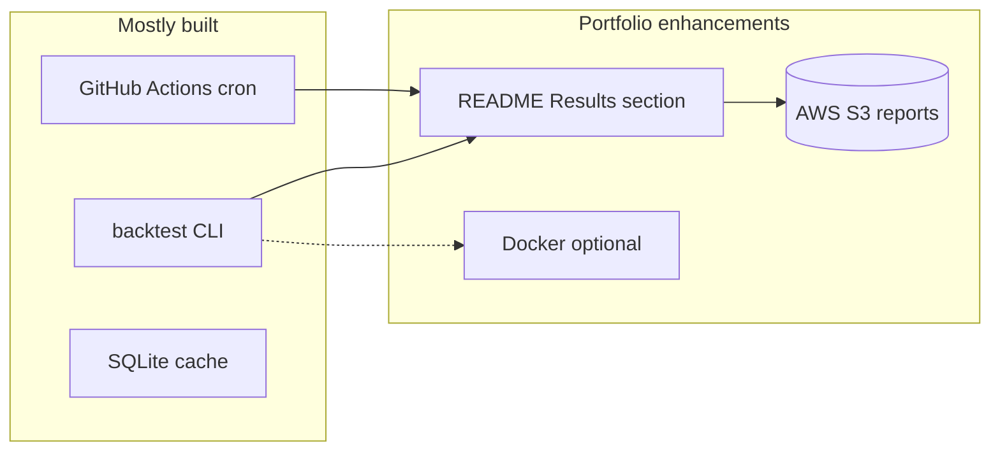

# CONTEXT.md — Domain Language & Ubiquitous Terms

This document defines the shared vocabulary for the multi-modal stock recommender. All code, documentation, and conversation should use these terms consistently.

## Core Concepts

### Thesis
**Sentiment-Price Lag:** News and social sentiment shifts precede price movement by 1-48 hours. This temporal lag is the window of opportunity.

**Cross-Modal Divergence:** When technical indicators (RSI, MACD, moving averages) and sentiment signals (news, social buzz) disagree on a stock's direction, the divergence itself predicts short-term (5-day) returns. This is the primary predictive signal.

### Stock Universe
**Dynamic Buzz-Driven Universe:** The system does not use a pre-defined stock list. Each week, it scans news, social media, and analyst coverage to discover which stocks are being discussed. The "most-discussed" stocks become that week's universe (~30-50 candidates after filtering). This avoids selection bias and surfaces high-attention stocks where sentiment matters most.

**Filtering Rules:** Penny stocks (< $5), ultra-low volume (< 100k avg daily), and stocks with fewer than 3 cross-source mentions are excluded.

### Tournament
**Weekly Tournament:** The system runs every Sunday, produces Top 15 picks, and tracks outcomes the following week. This is not a one-shot prediction — it is a continuous competition cycle.

**Recursive Feedback:** Each week's outcomes feed back into the next week's model. The system learns from its own mistakes by comparing predicted grades vs actual returns.

## Domain Models

### Signal
A market data observation at a specific point in time: price, volume, OHLC. Immutable. Must have timestamp <= prediction_time.

### Sentiment
A sentiment observation from a specific source (news, Reddit, StockTwits) at a specific time. Score in [-1.0, 1.0]. Immutable. Must have timestamp <= prediction_time.

### TechnicalIndicators
Computed from Signal data: RSI(14), MACD, SMA(20/50/200), Bollinger Bands, volume trend. Produces a composite `technical_signal` in [-1.0, 1.0] where -1.0 = fully bearish, 1.0 = fully bullish.

### DivergenceSignal
The disagreement between technical_signal and sentiment_signal for a given stock. Contains:
- `divergence_score` — magnitude of disagreement (0.0 = aligned, 2.0 = max divergence)
- `divergence_type` — "bullish_divergence" (sentiment bullish, technicals bearish), "bearish_divergence" (sentiment bearish, technicals bullish), or "aligned"

### StockRecommendation
A graded pick for a specific stock in a specific week. Contains the grade, composite score, predicted 5-day return, confidence, supporting indicators, and human-readable reasoning.

### RecommendationGrade (updated — ADR-015)
Five-tier grading system based on multi-horizon magnitude predictions:
- **Strong Buy** — Bullish on 2+ horizons, magnitude > 5% on longest horizon
- **Buy** — Bullish on 1+ horizon, magnitude > threshold
- **Hold** — Neutral on all horizons OR conflicting signals across horizons
- **May Sell** — Bearish on 1+ horizon
- **Immediate Sell** — Bearish on 2+ horizons, magnitude > -3%

### Multi-Horizon Prediction (ADR-015)
Model predicts return magnitude at three timeframes per ticker:
| Horizon | Noise threshold | Signal type |
|---------|-----------------|-------------|
| 2-day | ±1.5% | News reaction, short-term momentum |
| 5-day | ±2.0% | Divergence signal, trend confirmation |
| 10-day | ±3.0% | Value recovery, sector rotation |

Predictions below threshold = "no actionable signal" (noise). Model only recommends when magnitude exceeds threshold. This eliminates false positives from tiny moves classified as "up."

Hold duration emerges from horizon disagreement:
- Bullish at 2d, neutral at 5d → short hold (2-3 days)
- Neutral at 2d, bullish at 10d → longer hold (5-10 days)
- Bullish all horizons → strong conviction, hold until flip

### WeeklyReport
The complete output of one tournament round: 15 recommendations + carryover updates for last week's picks + accuracy comparison vs previous week + SPY benchmark.

### AccuracyRecord
Historical record comparing what was predicted vs what actually happened. Used for rolling 90-day accuracy tracking and Sharpe ratio computation.

## Key Ports (Interfaces)

### MarketDataPort
Loads OHLCV price data with strict point-in-time filtering. Must never return data after prediction_time.

### NewsDiscoveryPort
Discovers articles mentioning stocks via RSS feeds or Google Custom Search. Returns article metadata (URL, title, snippet, source, date).

### BuzzScorerPort
Measures social buzz from Reddit and StockTwits. Returns trending tickers with mention counts and raw post text.

### SentimentScorerPort
Converts text to sentiment score [-1.0, 1.0]. Implementations: keyword baseline, Flan-T5 fine-tuned, LLM API. Swappable without changing pipeline logic.

### RecommendationStorePort
Persists and retrieves weekly reports and accuracy records. SQLite today, PostgreSQL later. The port abstraction makes the swap transparent.

### TechnicalAnalysisPort
Computes technical indicators from raw OHLCV data. Returns TechnicalIndicators with composite signal.

## Feature Groups (101 built — 45 technical, 24 sentiment, 16 fundamental, 8 cross-asset, 8 event-causal)

| Group | Count | Source | Phase |
|-------|-------|--------|-------|
| Technical | 15 | yfinance OHLCV data | 3A |
| Regime Context | 10 | yfinance 2-3yr history | 3A |
| Stronger Signals | 7 | yfinance (short interest, earnings surprise, IV) | 3A |
| Sector Context | 3 | Sector ETFs via yfinance | 3A |
| Options Flow | 4 | yfinance options chain | 3A |
| Analyst Actions | 4 | yfinance analyst recommendations | 3A |
| Cross-Correlation | 3 | Peer group comparison | 3A |
| Macro Regime | 5 | VIX, 10Y yield, DXY, yield curve, SPY momentum | 3A |
| Sentiment/Buzz | 11 | News + social sources | 3B |
| Divergence | 4 | Computed (technical vs sentiment) | 3B |

### Regime Features (new — ADR-010)
Historical context features computed from 2-3 years of data:
- `price_vs_52w_high`, `price_vs_52w_low` — position relative to yearly range
- `market_cap_quintile` — large cap returns compress vs mid/small
- `return_6m`, `return_12m` — medium-term momentum (strongest documented factor)
- `volatility_regime` — current vol vs own 1yr history
- `drawdown_from_ath` — distance from all-time high (mean reversion signal)
- `sector_relative_strength_6m` — stock vs sector peers
- `revenue_growth_yoy` — fundamental growth trajectory
- `pe_vs_sector_median` — relative valuation

### Stronger Signal Features (new — grilling session)
Academically-backed features replacing weaker signals:
- `short_interest_ratio`, `short_interest_change_5d` — crowded short / squeeze potential
- `earnings_surprise_last`, `earnings_surprise_streak` — PEAD anomaly
- `iv_skew_25d`, `iv_rank_percentile` — options market pricing directional risk
- `institutional_ownership_change` — smart money flow

### Feature Pruning Strategy
All 61 features ship in Phase 3A/3B. After 4-6 weeks of live data, SHAP importance identifies which 15-20 features carry 80% of signal. Prune the rest in Phase 4. Data-driven pruning, not intuition-based.

## NLP Progression Ladder (updated — ADR-008)

| Step | Model | Cost | When |
|------|-------|------|------|
| 1+2 (parallel) | Keyword scoring + Flan-T5 zero-shot | Free | Phase 3B — both run simultaneously |
| 3 | Claude/Gemini as LLM Analyst | ~$5-15/week | Phase 4 — causal reasoning, not just classification |

**Key change (ADR-008):** Steps 1 and 2 run in parallel from day one, not sequentially. This eliminates ambiguity: if both show no divergence signal → thesis problem. If Flan-T5 shows signal but keywords don't → scorer problem.

**Phase 4 reframe:** LLM tier is no longer "better sentiment scorer." It becomes LLM-as-analyst — extracting structured market intelligence with causal chain reasoning (e.g., "Intel layoffs → ASML reduced orders → AMD benefits from talent migration"). This is the 2026-era approach.

**Upgrade rule remains:** Never upgrade NLP without measuring lift. If Step N+1 improves precision by < 2%, stay at Step N.

## Evaluation Framework (expanded — ADR-011)

### Core Metrics
| Metric | What It Measures | Benchmark |
|--------|-----------------|-----------|
| Cumulative return (cost-adjusted) | Business value | SPY ETF same period |
| Sharpe ratio | Risk-adjusted return | SPY Sharpe ratio |
| Directional accuracy | Prediction quality | 50% (random baseline) |
| Precision per grade | Grade reliability | Per-grade historical average |

### Statistical Rigor (new)
| Component | What It Proves |
|-----------|---------------|
| Permutation test (1000 shuffles) | Skill vs luck. p < 0.05 required |
| Walk-forward validation | Results hold across time periods, not just one split |
| Transaction cost modeling (0.1% default) | Returns are real after trading costs |
| Regime-aware splits (bull/sideways/bear) | Model works in all conditions, not just bull markets |
| Maximum drawdown + recovery time | Risk profile for real-money deployment decisions |

### Ablation Study (new — measures each component's value)
| Model Variant | What It Proves |
|---------------|---------------|
| Technical-only | Baseline — does price data alone predict? |
| Sentiment-only | Does sentiment alone predict? |
| Combined (divergence) | Does fusion add value over either alone? |

**Never claim "beats the market" without Sharpe ratio comparison.** Raw returns without risk adjustment are misleading.

**Never claim "model has edge" without permutation test p-value.** Directional accuracy alone is anecdote, not evidence.

## Market Configuration

Markets are config-driven via YAML files in `config/markets/`. Each market defines:
- RSS feed URLs
- Google search targets
- Reddit subreddits
- Sector ETFs
- Trading hours and timezone
- Filtering thresholds

Adding a new market = adding a YAML file. No code changes required.

| Market | Config | Status |
|--------|--------|--------|
| US (NYSE/NASDAQ) | `us.yaml` | Phase 3 (active) |
| Canada (TSX) | `ca.yaml` | Phase 4 (planned) |
| India (NSE/BSE) | `in.yaml` | Phase 5 (planned) |

## Phase 3A Backtest Results (2026-05-29)

### Walk-Forward Directional Accuracy (40 tickers, 2024-01 to 2026-05, 19 folds)
| Horizon | Avg Accuracy | Min | Max | Verdict |
|---------|-------------|-----|-----|---------|
| 5d | 51.6% | 22.5% | 92.5% | Marginally above random |
| 2d | 47.1% | 20.0% | 65.0% | Near random |
| 10d | 47.1% | 30.0% | 60.0% | Near random |

**Interpretation:** Technical-only model (no sentiment) clusters around 50% on S&P 500 mega-caps. Expected per EMH. This is the clean baseline — Phase 3B sentiment divergence must demonstrate lift above this.

### SHAP Feature Importance (4 folds, 10 tickers, 5d horizon)
**Top 5 features (by mean |SHAP|):**
1. `correlation_with_spy` — 0.0154 (CV=0.48, **stable**)
2. `return_1d` — 0.0106 (CV=1.48, unstable)
3. `obv_trend` — 0.0089 (CV=1.73, unstable)
4. `return_5d` — 0.0060 (CV=1.70, unstable)
5. `drawdown_from_ath` — 0.0048 (CV=1.20, unstable)

**Only 3 features are both important AND stable:** `correlation_with_spy`, `macd`, `macd_histogram`

**32 of 45 features have near-zero importance.** All options, analyst, macro, and most regime features contribute nothing — mostly NaN from sparse yfinance data. Candidates for pruning before Phase 3B.

### Bugs Found and Fixed During Backtest
1. **Cache staleness** — `use_cache=True` served wrong date ranges. Fix: disabled for backtest.
2. **2d weekend bug** — month-end on weekends + 2 calendar days = zero trading days. Fix: +5 buffer days, pick h_days-th trading day.
3. **Rate limit crash** — unhandled `YFRateLimitError` in macro fetch. Fix: retry 3x + throttle.

## Phase 3A Methodology Review Findings (2026-05-29)

### Resolved Decisions
| Decision | Resolution | ADR |
|----------|------------|-----|
| Imputation asymmetry | Native NaN for XGBoost/LightGBM, stored medians for Ridge | ADR-018 |
| Hardcoded confidence | Ensemble disagreement (inverse variance of sub-model predictions) | ADR-019 |
| No naive baselines | Momentum, low-vol, random (100 trials), equal-weight | ADR-020 |
| Composite score uses abs() | Signed values for long-only ranking (long-short deferred Phase 4) | — |
| sector_relative_strength_6m always NaN | Wire using sector ETF data from us.yaml | — |
| EvaluationUseCase is a stub | Wire all 5 ADR-011 components; pretraining stores raw data, EvaluationUseCase runs full suite | — |
| SHAP importance missing | Per-fold TreeExplainer, fallback to final-model-only if slow | — |
| No real-data backtest | Run pretrain on 40 S&P 500 tickers, 2024-01 to 2026-05 | — |

### Alternative Methodologies Investigated (Not Adopted — Tracked for Future)
- **Conformal prediction:** Distribution-free prediction intervals. Deferred to Phase 4 (ADR-019).
- **Online learning / incremental models:** River/VW for non-stationary adaptation. Deferred — monthly batch retraining sufficient for Phase 3A.
- **Regime-conditional models (Mixture of Experts):** Separate models per bull/bear/sideways. Data-limited with 2-3 years. Revisit Phase 4 with more data.
- **Direct portfolio optimization:** Markowitz/Black-Litterman. Phase 4 scope with position sizing.
- **Cross-sectional rank prediction:** Predict relative rank instead of absolute returns. Promising but conflicts with Phase 3B dynamic universe.

### Key References from Review
- Gu, Kelly & Xiu (2020) — "Empirical Asset Pricing via Machine Learning" — cross-sectional stock prediction benchmark
- Angelopoulos & Bates (2022) — "Conformal Prediction: A Gentle Introduction" — uncertainty quantification
- DeMiguel, Garlappi & Uppal (2009) — "Optimal Versus Naive Diversification" — 1/N portfolio often beats optimization
- Guidolin & Timmermann (2007) — regime-switching models for equity returns

## Anti-Patterns (Never Do These)

- **Never use future-dated data** — `FUTURE_LEAKAGE_COLUMNS` lists forbidden features
- **Never evaluate with accuracy alone** — class distribution and directional accuracy require precision/recall
- **Never skip the keyword baseline** — it is the control group for all NLP experiments
- **Never hardcode stock tickers** — the universe is dynamic, discovered weekly
- **Never merge sentiment from different time zones without normalization** — US market hours differ from when news publishes
- **Never trust raw social sentiment** — normalize, aggregate, require minimum source diversity
- **Never claim statistical significance without permutation test** — p < 0.05 or it's luck
- **Never report returns without transaction costs** — gross returns are misleading (0.1% per trade default)
- **Never use yfinance adjusted prices in backtesting** — `auto_adjust=False` to avoid revision bias
- **Never backtest without known_universe snapshots** — survivorship bias inflates returns 3-5%
- **Never draw thesis conclusions from a single NLP scorer** — parallel baselines (ADR-008) required
- **Never run pipeline without caching raw data** — every API response cached at fetch time (ADR-017). Reproducibility is non-negotiable.
- **Never overwrite cached data** — cache is append-only, keyed by fetch timestamp

## VanEck BUZZ ETF — Competitive Reference

The BUZZ ETF (VanEck Social Sentiment ETF) validates that sentiment data contains signal but demonstrates how NOT to use it:
- Selects 75 most-positively-discussed large-cap stocks monthly
- Beta: 1.65 (65% more volatile than S&P 500 for roughly equivalent returns)
- AUM collapsed from ~$400M to ~$120M — market voted with its feet
- No divergence signal — just buys popular stocks (popularity contest)
- Structural tech overweight (36%) from online discussion bias

**Our key differentiator:** We measure sentiment-price *divergence*, not raw positive sentiment. Divergence is inherently contrarian. BUZZ is pro-cyclical. Academic literature (Baker & Wurgler 2006) supports contrarian sentiment signals over momentum sentiment signals.

## Model Architecture — Two-Stage Stacking (ADR-014)

```
Stage 1: Pretrained Technical Model (FROZEN, retrained monthly)
  ├── Input:  41 features (technical + regime + macro + options + sector + cross-corr)
  ├── Training: 2-3 years historical data (3,000-5,000 rows)
  ├── Output: predicted_return_technical, confidence_technical
  └── Models: XGBoost + LightGBM + Ridge ensemble

Stage 2: Sentiment Blending Model (warm-started weekly)
  ├── Input:  Stage 1 outputs (2) + 25 sentiment/buzz/divergence features = 27 features
  ├── Training: 90-day backfill + live weekly accumulation
  ├── Output: final_predicted_return, final_confidence
  └── Models: Shallow XGBoost (max_depth=3) or Ridge
```

**Decay weighting:** 8-week half-life (configurable). `weight = 0.5 ** (weeks_ago / half_life)`. Tune empirically after 3 months of live data.

**Retrain schedule:** Stage 1 monthly full retrain. Stage 2 weekly warm-start, full retrain monthly or after 3 consecutive weeks of degraded accuracy.

## Production Deployment Path (new)

For real-money deployment, the prediction model is necessary but not sufficient. Required layers:
1. **Predictions** — Phase 3A/3B (this project)
2. **Risk management** — stop-loss, position limits, sector caps (✅ Phase 4B: stop-loss + sell signals implemented)
3. **Position sizing** — Kelly Criterion, confidence-weighted allocation (Phase 4)
4. **Hold duration** — predicted optimal hold period per pick (Phase 4)
5. **Paper trading validation** — 6 months minimum before real capital (Phase 5)
6. **Recursive learning** — decay-weighted retraining from outcomes (Phase 3B)

**6 months of paper trading before real money. Non-negotiable.**

## Future Validation & Backtesting Roadmap

Items to validate, test, and backtest in Phase 4, 5, 6, and future state. These are NOT in scope for Phase 3 but must be tracked for when those phases begin.

### Phase 4: Tracking & Intelligence — Validation Agenda
- [ ] **Portfolio correlation constraints:** Backtest top-15 with max pairwise correlation 0.7 vs unconstrained. Measure: does diversification improve Sharpe without killing returns?
- [ ] **Position sizing (Kelly Criterion):** Backtest confidence-weighted allocation vs equal-weight. Measure: does Kelly improve risk-adjusted returns or just increase variance?
- [ ] **Hold duration optimization:** For each feature profile, compute actual optimal hold period from historical data. Validate: do momentum picks actually peak at day 3-5? Do value picks need 2-4 weeks?
- [ ] **LLM analyst layer:** Compare Claude/Gemini causal reasoning extraction vs Flan-T5 sentiment classification. Measure: precision lift, cost per prediction, latency impact.
- [ ] **Risk management rules:** Backtest stop-loss thresholds (-5%, -8%, -10%). Which minimizes drawdown without triggering on normal volatility?
- [ ] **Cross-stock features:** Validate supply chain propagation signals (TSMC → NVDA/AMD). Do they improve prediction or add noise?
- [ ] **Sector rotation detection:** Can the model detect money flowing between sectors before it shows up in price?
- [ ] **Decay half-life tuning:** After 3 months live data, optimize half-life from [4, 6, 8, 10, 12] weeks via walk-forward.
- [ ] **Long-short composite ranking (Option B):** Separate long and short rankings — top 15 longs by positive composite, top 5 shorts by most negative. Enables long-short portfolio. Requires position sizing + risk management from Phase 4. Phase 3A uses signed composite (long-only).
- [ ] **Conformal prediction intervals (Option A):** Replace ensemble-disagreement confidence with `mapie` conformal prediction for formal coverage guarantees. Phase 3A uses ensemble variance as proxy confidence.

### Phase 5: Dashboard & Polish — Validation Agenda
- [ ] **Paper trading vs live tracking dashboard:** Real-time comparison of model predictions vs market outcomes, displayed visually.
- [ ] **Regime detection accuracy:** Validate that bull/sideways/bear classification matches actual market conditions (VIX, drawdown-based).
- [ ] **Feature importance stability:** Track SHAP feature rankings weekly. If top-10 features change dramatically week-to-week, model is unstable.
- [ ] **Sector concentration monitoring:** Dashboard alert when >40% of picks are in one sector.
- [ ] **Canadian market (ca.yaml):** Validate that US-trained model transfers to TSX or needs separate training.
- [ ] **Indian market (in.yaml):** Different market microstructure — validate sentiment-price lag hypothesis holds in NSE/BSE.
- [ ] **Confidence calibration:** Plot predicted confidence vs actual accuracy. If model says "80% confident" it should be right ~80% of the time.

### Phase 6: Real Money Pilot — Validation Agenda
- [ ] **Paper trading minimum 6 months:** No exceptions. Must show statistically significant edge (p < 0.05) before real capital.
- [ ] **Slippage modeling:** Difference between model's assumed execution price vs actual fill price. Backtest with 0.05%, 0.1%, 0.2% slippage levels.
- [ ] **Liquidity impact:** For small-cap picks, does our order size move the price? Model position sizes that won't impact the market.
- [ ] **Tax-loss harvesting:** Can the model identify when to sell losing positions for tax benefit while maintaining portfolio thesis?
- [ ] **Drawdown circuit breaker:** If portfolio drawdown exceeds -15%, auto-reduce position sizes by 50%. Backtest impact.
- [ ] **Black swan resilience:** How does the model behave during flash crashes, pandemic-style drops, geopolitical shocks? Backtest on March 2020, Jan 2022 rate shock.

### Future State — Research Backlog
- [ ] **Full point-in-time mitigation (ADR-010 option C):** Store all raw data with fetch timestamps. Backtest only uses data fetched before prediction_time.
- [ ] **Survivorship-bias-free backtesting:** Obtain historical delisted stock data. Re-run all backtests including stocks that were later delisted.
- [ ] **Alternative data sources:** Satellite imagery (parking lots → retail sales), credit card transaction data, web traffic (SimilarWeb), app downloads (Sensor Tower). Cost-benefit analysis for each.
- [ ] **Graph neural networks:** Model stock-to-stock relationships (supply chain, sector, correlation). Does GNN improve over flat feature vectors?
- [ ] **Reinforcement learning for dynamic allocation:** RL agent learns to size positions and time entries/exits. Compare vs Kelly Criterion.
- [ ] **Transformer-based temporal model:** Self-attention over weekly feature sequences. Does temporal context improve over flat snapshot predictions?
- [ ] **Multi-frequency fusion:** Daily signals for timing, weekly signals for direction, monthly signals for regime. Combine across timeframes.
- [ ] **Earnings call NLP:** Real-time transcription + LLM analysis of quarterly earnings calls. Measure signal vs cost.
- [ ] **Dark pool activity:** Institutional block trades as signal. Requires paid data (Quandl/Nasdaq).
- [ ] **VanEck BUZZ comparison benchmark:** Ongoing comparison — does our divergence approach outperform BUZZ's popularity approach on same universe?
- [ ] **Ensemble weight optimization:** Bayesian optimization of model weights in ensemble. Compare vs equal-weight and accuracy-weighted.

---

## Portfolio platform enhancements (2026-05-30)

**Reference:** [`../PORTFOLIO_TOOLS_PLAYBOOK.md`](../PORTFOLIO_TOOLS_PLAYBOOK.md) · Project 2 diagram

These are **separate from** Phase 4–6 quant research above — focused on **employer-visible E2E completion** and light cloud tooling.

### Apply-ready (finish E2E story)

| Priority | Enhancement | Tool | Status |
|----------|-------------|------|--------|
| P0 | Publish backtest results in README | `reports/backtest_*.json` | JSON exists — README pending |
| P0 | Permutation p-value + Sharpe vs SPY in README | evaluation.py output | Document measured numbers only |
| P1 | Upload backtest + SHAP JSON to S3 | AWS S3 | Add `scripts/upload_artifacts.py` |
| P1 | Document GitHub Actions cron as orchestration | GitHub Actions | Built — add README section (Airflow-equivalent narrative) |

### Optional layers

| Enhancement | Tool | Notes |
|-------------|------|-------|
| `Dockerfile` for reproducible `backtest` CLI | Docker | One-command reproduce for recruiters |
| Phase 3B sentiment ablation table in README | Existing code | Marginal lift doc — even null result is valuable |
| EC2 / Kubernetes | — | **Reject** |
| Databricks | — | **Skip** — not a warehouse problem |



---

## Session 5: Expanded Intelligence Engine — Grilling Outcomes (2026-06-01)

### Vision Expansion

10-question grilling session expanded project from 3-phase sentiment experiment into a 5-signal-layer always-learning stock intelligence engine. Full design spec: `docs/superpowers/specs/2026-06-01-expanded-intelligence-engine-design.md`

### Revised Phase Roadmap

| Phase | Scope | Status | Depends On |
|-------|-------|--------|------------|
| 3A | Core technical engine (45 features, ensemble, walk-forward, SHAP) | ✅ Complete | — |
| 3B Validation | Run existing sentiment pipeline end-to-end, fix breaks, ablation with real data | ✅ Complete (2026-06-01) | 3A |
| P0 Completeness | README p-values + Sharpe vs SPY, S3 upload script, fix stale CLAUDE.md | ✅ Complete (2026-06-01) | 3A |
| 3.5 | Expand sentiment (StockTwits + Google Trends + GDELT historical) + expand universe to 350 tickers | ✅ Complete | 3B Validation |
| 4A | Fundamental valuation features (PEG, P/E, P/B, FCF, dividends, earnings) | ✅ Complete | 3.5 |
| 4B | Portfolio holdings tracking + sell signals + stop-loss | ✅ Complete | 4A |
| 4C | Cross-asset intelligence — correlation graph, Granger causality, 10 supply chain groups, 8 features | ✅ Complete | 4A |
| 4D | Event-causal learning — Gemini classification, exponential decay impact, 8 features | ✅ Complete | 4C |
| 5 | Decision dashboard — 6-tab Streamlit (Command Center, Model Confidence, Signal Breakdown, Positions, Opportunities, Market Pulse) | ✅ Complete | 4D |

### Five Signal Layers (updated from 2 to 5)

| Layer | Features | Data Source | Phase |
|-------|----------|-------------|-------|
| Technical | 45 | yfinance OHLCV | ✅ 3A |
| Sentiment | 24 | RSS, StockTwits, Google Trends, GDELT | ✅ 3B + 3.5 |
| Fundamental | 16 | yfinance ticker_info (PEG, P/E, P/B, FCF, margins, debt) | ✅ 4A |
| Cross-Asset | 8 | Correlation graph + Granger lead-lag + supply chain YAML (10 groups) | ✅ 4C |
| Event-Causal | 8 | Gemini event classification + exponential decay impact learning | ✅ 4D |

### Key Decisions (ADRs 023-029)

| ADR | Decision | Rationale |
|-----|----------|-----------|
| 023 | Expand ticker universe to ~350 (S&P 500 + NASDAQ-100) | 40 was Phase 3A constraint; sentiment discovers tickers with no technical history |
| 024 | Historical sentiment via Google Trends + GDELT | No 4-week wait for live RSS; years of historical data exist |
| 025 | Fundamental valuation features from yfinance | Data already fetched via get_ticker_info(), just not in feature matrix |
| 026 | Portfolio holdings in SQLite + sell signal detection | Local, simple, manual CLI entry; brokerage API deferred to Phase 5/6 |
| 027 | Hybrid cross-asset graph: auto-correlation + manual supply chain YAML | Discovers unknown correlations, human validates; avoids spurious signals |
| 028 | Event-causal learning: LLM classification → historical sector impact → decay model | Learns "tariffs → energy+, tech-" with magnitude and duration |
| 029 | Cross-asset feature architecture: CrossAssetPort + dual adapter + Granger pre-filter | Correlation >0.65 pre-filter → Granger causality. 10 supply chain groups. Separate CorrelationAnalyzer + CrossAssetFeatureEngineer |
| 030 | Event-causal learning: Gemini free tier + empirical impact + exponential decay | 10 event categories, bootstrap impact table from GDELT, learned half-life per category×sector |
| 031 | Decision dashboard: 6-tab Streamlit + Plotly, command center first | Decision-oriented (not data viewer), Plotly interactive charts, watchlist feature, graceful empty states |

### Adapters

| Adapter | Port | Status |
|---------|------|--------|
| `adapters/data/google_trends_adapter.py` | BuzzDiscoveryPort | ✅ Phase 3.5 |
| `adapters/data/stocktwits_adapter.py` | BuzzDiscoveryPort | ✅ Phase 3.5 |
| `adapters/data/gdelt_sentiment_adapter.py` | HistoricalSentimentPort | ✅ Phase 3.5 |
| `adapters/ml/fundamental_feature_engineer.py` | FeatureEngineerPort | ✅ Phase 4A |
| `application/monitor_holdings.py` | MonitorHoldingsUseCase | ✅ Phase 4B |
| `adapters/ml/correlation_analyzer.py` | CorrelationAnalyzerPort | ✅ Phase 4C |
| `adapters/ml/gemini_event_classifier.py` | EventClassifierPort | ✅ Phase 4D |
| `adapters/visualization/dashboard.py` | Streamlit dashboard (6 tabs) | ✅ Phase 5 |
| `adapters/visualization/data_loader.py` | SQLite + JSON loading | ✅ Phase 5 |

### New Domain Models

- `Holding` — symbol, quantity, purchase_price, purchase_date, notes (✅ Phase 4B)
- `SellSignal` — symbol, signal_date, signal_type, urgency, reasoning, confidence (✅ Phase 4B)
- `EventCategory` — enum of 10 news event types (Phase 4D planned)
- `EventSectorImpact` — event → sector → direction → magnitude → duration → confidence (Phase 4D planned)

### Cross-Asset Supply Chain Graph (Hybrid — ADR-027)

Auto-discovered correlation clusters + manual YAML override in `config/supply_chains.yaml`:
- semiconductors: AMAT/LRCX/KLAC → MU/WDC/SNDK/AMD/NVDA
- space_defense: SpaceX catalyst → STM/HXL/IRDM/LUNR/ASTS/RKLB
- pharma_supply_chain: PFE/JNJ → MCK/ABC/CAH → WMT/CVS/WBA
- big_tech_ecosystem: AAPL/MSFT/GOOG → TSM/AVGO/QCOM
- energy_chain: XOM/CVX → WMB/KMI → VLO/MPC (inverse: DAL/UAL/AAL)

### Realistic Targets (agreed during grilling)

| Metric | Target |
|--------|--------|
| Sentiment classification accuracy | 65-70% |
| Stock direction prediction | 52-55% (over 50% random) |
| Edge over technical-only | 2-5% lift |
| Cross-asset cascade follow-through | 60-70% |
| Sell signal precision | >60% |

Honest null result remains valid — rigorous negative finding is equally impressive for portfolio.

### Immediate Next Steps (in order)

1. ~~P0 Portfolio Completeness~~ — ✅ Complete
2. ~~Phase 3B Validation~~ — ✅ Complete (2026-06-01). Technical-only 47.4% → +sentiment 69.7% (in-sample). PR #9 shipped.
3. ~~Phase 3.5~~ — ✅ Complete. Google Trends + StockTwits + GDELT + 350 tickers. PR #10 merged.
4. ~~Phase 4A~~ — ✅ Complete. 16 fundamental features. PR #11 merged.
5. ~~Phase 4B~~ — ✅ Complete. Portfolio tracking + sell signals. PR #12 merged. 334 tests.
6. ~~Phase 4C~~ — ✅ Complete. Correlation graph + Granger causality + 10 supply chain groups + 8 features. PR #13 merged. 371 tests.
7. ~~Phase 4D~~ — ✅ Complete. Gemini event classification + exponential decay impact + 8 features. PR #14 merged. 410 tests.
8. ~~Phase 5~~ — ✅ Complete. 6-tab Streamlit dashboard, Plotly charts, watchlist, 472 tests. PR #15 merged.
