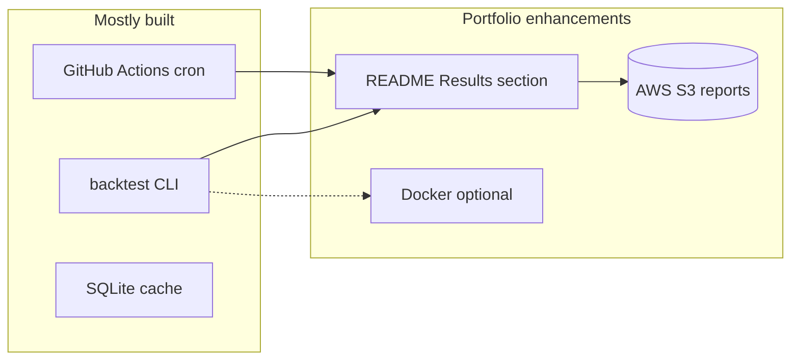

# CONTEXT.md — Domain Language & Ubiquitous Terms

This document defines the shared vocabulary for the multi-modal stock recommender. All code, documentation, and conversation should use these terms consistently.

## Core Concepts

### Thesis
**Sentiment-Price Lag:** News and social sentiment shifts precede price movement by 1-48 hours. This temporal lag is the window of opportunity.

**Cross-Modal Divergence:** When technical indicators (RSI, MACD, moving averages) and sentiment signals (news, social buzz) disagree on a stock's direction, the divergence itself predicts short-term (5-day) returns. This is the primary predictive signal.

### Stock Universe
**Dynamic Buzz-Driven Universe:** The system does not use a pre-defined stock list. Each week, it scans news, social media, and analyst coverage to discover which stocks are being discussed. The "most-discussed" stocks become that week's universe (~30-50 candidates after filtering). This avoids selection bias and surfaces high-attention stocks where sentiment matters most.

**Filtering Rules:** Penny stocks (< $5), ultra-low volume (< 100k avg daily), and stocks with fewer than 3 cross-source mentions are excluded.

### Tournament
**Weekly Tournament:** The system runs every Sunday, produces Top 15 picks, and tracks outcomes the following week. This is not a one-shot prediction — it is a continuous competition cycle.

**Recursive Feedback:** Each week's outcomes feed back into the next week's model. The system learns from its own mistakes by comparing predicted grades vs actual returns.

## Domain Models

### Signal
A market data observation at a specific point in time: price, volume, OHLC. Immutable. Must have timestamp <= prediction_time.

### Sentiment
A sentiment observation from a specific source (news, Reddit, StockTwits) at a specific time. Score in [-1.0, 1.0]. Immutable. Must have timestamp <= prediction_time.

### TechnicalIndicators
Computed from Signal data: RSI(14), MACD, SMA(20/50/200), Bollinger Bands, volume trend. Produces a composite `technical_signal` in [-1.0, 1.0] where -1.0 = fully bearish, 1.0 = fully bullish.

### DivergenceSignal
The disagreement between technical_signal and sentiment_signal for a given stock. Contains:
- `divergence_score` — magnitude of disagreement (0.0 = aligned, 2.0 = max divergence)
- `divergence_type` — "bullish_divergence" (sentiment bullish, technicals bearish), "bearish_divergence" (sentiment bearish, technicals bullish), or "aligned"

### Dead Dimension (discrimination audit)
A conviction dimension that produces zero variance across all scored candidates — typically because the underlying data source structurally returns nothing for the target universe. On the thematic mid-cap spine, a discrimination audit (2026-06-05, n=63 warmed candidates) found 6 of 8 conviction dimensions dead: `smart_money` (var=0.000, SEC EDGAR 13D/Form-4 absent for mid-caps), `signal_agreement` (var=0.000, derived from dead dims), `sentiment_momentum` (var=0.000, neutral_share=1.00 — not computed in bulk), `ml_direction` (var=0.000, neutral_share=1.00 — no per-ticker inference in bulk), `event_signal` (var=0.000, neutral_share=1.00 — Gemini per-ticker cost deferred), and `analyst_signal` (var=0.000, neutral_share=1.00 — no coverage for these names). Only `temporal_freshness` (var=2.649) and `fundamental_basis` (var=0.250) vary. Dead dimensions are not pruned from the domain model — they are marked inactive for the specific universe and excluded from the surface trigger. See ADR-043.

### Divergence-Led Surfacing (sub-project C, pending)
An alternative surfacing strategy in which **attention-acceleration vs price** (the `divergence_score` from `blended_divergence_score()`, combining event-acceleration + intensity-acceleration) is the **primary** trigger, and conviction (from live dims only) is a **light tiebreaker**. This inverts the Phase 7–9 design (`conviction × divergence` layered trigger) to resolve the finding that conviction is freshness-dominated on the thematic spine. A candidate surfaces when divergence clears `dmin` and conviction — computed from whatever dims are live — ranks above competing candidates at the same divergence level. Honest abstention and the minimum-history gate (`has_min_history`) are retained. Implementation is pending (sub-project C). See ADR-043.

### Conviction (engine status, 2026-06-05)
On the thematic mid-cap spine, conviction is freshness-dominated: with 6 of 8 dims dead, the engine effectively ranks names by how recently their data was fetched (`temporal_freshness`), not by opportunity quality. Conviction remains in the architecture as a tiebreaker but should not be read as "opportunity confidence" on this universe until sub-project C wires divergence as the primary gate. See ADR-043 for the discrimination audit numbers and the decision to pivot.

### StockRecommendation
A graded pick for a specific stock in a specific week. Contains the grade, composite score, predicted 5-day return, confidence, supporting indicators, and human-readable reasoning.

### RecommendationGrade (updated — ADR-015)
Five-tier grading system based on multi-horizon magnitude predictions:
- **Strong Buy** — Bullish on 2+ horizons, magnitude > 5% on longest horizon
- **Buy** — Bullish on 1+ horizon, magnitude > threshold
- **Hold** — Neutral on all horizons OR conflicting signals across horizons
- **May Sell** — Bearish on 1+ horizon
- **Immediate Sell** — Bearish on 2+ horizons, magnitude > -3%

### Multi-Horizon Prediction (ADR-015)
Model predicts return magnitude at three timeframes per ticker:
| Horizon | Noise threshold | Signal type |
|---------|-----------------|-------------|
| 2-day | ±1.5% | News reaction, short-term momentum |
| 5-day | ±2.0% | Divergence signal, trend confirmation |
| 10-day | ±3.0% | Value recovery, sector rotation |

Predictions below threshold = "no actionable signal" (noise). Model only recommends when magnitude exceeds threshold. This eliminates false positives from tiny moves classified as "up."

Hold duration emerges from horizon disagreement:
- Bullish at 2d, neutral at 5d → short hold (2-3 days)
- Neutral at 2d, bullish at 10d → longer hold (5-10 days)
- Bullish all horizons → strong conviction, hold until flip

### WeeklyReport
The complete output of one tournament round: 15 recommendations + carryover updates for last week's picks + accuracy comparison vs previous week + SPY benchmark.

### AccuracyRecord
Historical record comparing what was predicted vs what actually happened. Used for rolling 90-day accuracy tracking and Sharpe ratio computation.

## Key Ports (Interfaces)

### MarketDataPort
Loads OHLCV price data with strict point-in-time filtering. Must never return data after prediction_time.

### NewsDiscoveryPort
Discovers articles mentioning stocks via RSS feeds or Google Custom Search. Returns article metadata (URL, title, snippet, source, date).

### BuzzScorerPort
Measures social buzz from Reddit and StockTwits. Returns trending tickers with mention counts and raw post text.

### SentimentScorerPort
Converts text to sentiment score [-1.0, 1.0]. Implementations: keyword baseline, Flan-T5 fine-tuned, LLM API. Swappable without changing pipeline logic.

### RecommendationStorePort
Persists and retrieves weekly reports and accuracy records. SQLite today, PostgreSQL later. The port abstraction makes the swap transparent.

### TechnicalAnalysisPort
Computes technical indicators from raw OHLCV data. Returns TechnicalIndicators with composite signal.

## Feature Groups (101 built — 45 technical, 24 sentiment, 16 fundamental, 8 cross-asset, 8 event-causal)

| Group | Count | Source | Phase |
|-------|-------|--------|-------|
| Technical | 15 | yfinance OHLCV data | 3A |
| Regime Context | 10 | yfinance 2-3yr history | 3A |
| Stronger Signals | 7 | yfinance (short interest, earnings surprise, IV) | 3A |
| Sector Context | 3 | Sector ETFs via yfinance | 3A |
| Options Flow | 4 | yfinance options chain | 3A |
| Analyst Actions | 4 | yfinance analyst recommendations | 3A |
| Cross-Correlation | 3 | Peer group comparison | 3A |
| Macro Regime | 5 | VIX, 10Y yield, DXY, yield curve, SPY momentum | 3A |
| Sentiment/Buzz | 11 | News + social sources | 3B |
| Divergence | 4 | Computed (technical vs sentiment) | 3B |

### Regime Features (new — ADR-010)
Historical context features computed from 2-3 years of data:
- `price_vs_52w_high`, `price_vs_52w_low` — position relative to yearly range
- `market_cap_quintile` — large cap returns compress vs mid/small
- `return_6m`, `return_12m` — medium-term momentum (strongest documented factor)
- `volatility_regime` — current vol vs own 1yr history
- `drawdown_from_ath` — distance from all-time high (mean reversion signal)
- `sector_relative_strength_6m` — stock vs sector peers
- `revenue_growth_yoy` — fundamental growth trajectory
- `pe_vs_sector_median` — relative valuation

### Stronger Signal Features (new — grilling session)
Academically-backed features replacing weaker signals:
- `short_interest_ratio`, `short_interest_change_5d` — crowded short / squeeze potential
- `earnings_surprise_last`, `earnings_surprise_streak` — PEAD anomaly
- `iv_skew_25d`, `iv_rank_percentile` — options market pricing directional risk
- `institutional_ownership_change` — smart money flow

### Feature Pruning Strategy
All 61 features ship in Phase 3A/3B. After 4-6 weeks of live data, SHAP importance identifies which 15-20 features carry 80% of signal. Prune the rest in Phase 4. Data-driven pruning, not intuition-based.

## NLP Progression Ladder (updated — ADR-008)

| Step | Model | Cost | When |
|------|-------|------|------|
| 1+2 (parallel) | Keyword scoring + Flan-T5 zero-shot | Free | Phase 3B — both run simultaneously |
| 3 | Claude/Gemini as LLM Analyst | ~$5-15/week | Phase 4 — causal reasoning, not just classification |

**Key change (ADR-008):** Steps 1 and 2 run in parallel from day one, not sequentially. This eliminates ambiguity: if both show no divergence signal → thesis problem. If Flan-T5 shows signal but keywords don't → scorer problem.

**Phase 4 reframe:** LLM tier is no longer "better sentiment scorer." It becomes LLM-as-analyst — extracting structured market intelligence with causal chain reasoning (e.g., "Intel layoffs → ASML reduced orders → AMD benefits from talent migration"). This is the 2026-era approach.

**Upgrade rule remains:** Never upgrade NLP without measuring lift. If Step N+1 improves precision by < 2%, stay at Step N.

## Evaluation Framework (expanded — ADR-011)

### Core Metrics
| Metric | What It Measures | Benchmark |
|--------|-----------------|-----------|
| Cumulative return (cost-adjusted) | Business value | SPY ETF same period |
| Sharpe ratio | Risk-adjusted return | SPY Sharpe ratio |
| Directional accuracy | Prediction quality | 50% (random baseline) |
| Precision per grade | Grade reliability | Per-grade historical average |

### Statistical Rigor (new)
| Component | What It Proves |
|-----------|---------------|
| Permutation test (1000 shuffles) | Skill vs luck. p < 0.05 required |
| Walk-forward validation | Results hold across time periods, not just one split |
| Transaction cost modeling (0.1% default) | Returns are real after trading costs |
| Regime-aware splits (bull/sideways/bear) | Model works in all conditions, not just bull markets |
| Maximum drawdown + recovery time | Risk profile for real-money deployment decisions |

### Ablation Study (new — measures each component's value)
| Model Variant | What It Proves |
|---------------|---------------|
| Technical-only | Baseline — does price data alone predict? |
| Sentiment-only | Does sentiment alone predict? |
| Combined (divergence) | Does fusion add value over either alone? |

**Never claim "beats the market" without Sharpe ratio comparison.** Raw returns without risk adjustment are misleading.

**Never claim "model has edge" without permutation test p-value.** Directional accuracy alone is anecdote, not evidence.

## Market Configuration

Markets are config-driven via YAML files in `config/markets/`. Each market defines:
- RSS feed URLs
- Google search targets
- Reddit subreddits
- Sector ETFs
- Trading hours and timezone
- Filtering thresholds

Adding a new market = adding a YAML file. No code changes required.

| Market | Config | Status |
|--------|--------|--------|
| US (NYSE/NASDAQ) | `us.yaml` | Phase 3 (active) |
| Canada (TSX) | `ca.yaml` | Phase 4 (planned) |
| India (NSE/BSE) | `in.yaml` | Phase 5 (planned) |

## Phase 3A Backtest Results (2026-05-29)

### Walk-Forward Directional Accuracy (40 tickers, 2024-01 to 2026-05, 19 folds)
| Horizon | Avg Accuracy | Min | Max | Verdict |
|---------|-------------|-----|-----|---------|
| 5d | 51.6% | 22.5% | 92.5% | Marginally above random |
| 2d | 47.1% | 20.0% | 65.0% | Near random |
| 10d | 47.1% | 30.0% | 60.0% | Near random |

**Interpretation:** Technical-only model (no sentiment) clusters around 50% on S&P 500 mega-caps. Expected per EMH. This is the clean baseline — Phase 3B sentiment divergence must demonstrate lift above this.

### SHAP Feature Importance (4 folds, 10 tickers, 5d horizon)
**Top 5 features (by mean |SHAP|):**
1. `correlation_with_spy` — 0.0154 (CV=0.48, **stable**)
2. `return_1d` — 0.0106 (CV=1.48, unstable)
3. `obv_trend` — 0.0089 (CV=1.73, unstable)
4. `return_5d` — 0.0060 (CV=1.70, unstable)
5. `drawdown_from_ath` — 0.0048 (CV=1.20, unstable)

**Only 3 features are both important AND stable:** `correlation_with_spy`, `macd`, `macd_histogram`

**32 of 45 features have near-zero importance.** All options, analyst, macro, and most regime features contribute nothing — mostly NaN from sparse yfinance data. Candidates for pruning before Phase 3B.

### Bugs Found and Fixed During Backtest
1. **Cache staleness** — `use_cache=True` served wrong date ranges. Fix: disabled for backtest.
2. **2d weekend bug** — month-end on weekends + 2 calendar days = zero trading days. Fix: +5 buffer days, pick h_days-th trading day.
3. **Rate limit crash** — unhandled `YFRateLimitError` in macro fetch. Fix: retry 3x + throttle.

## Phase 3A Methodology Review Findings (2026-05-29)

### Resolved Decisions
| Decision | Resolution | ADR |
|----------|------------|-----|
| Imputation asymmetry | Native NaN for XGBoost/LightGBM, stored medians for Ridge | ADR-018 |
| Hardcoded confidence | Ensemble disagreement (inverse variance of sub-model predictions) | ADR-019 |
| No naive baselines | Momentum, low-vol, random (100 trials), equal-weight | ADR-020 |
| Composite score uses abs() | Signed values for long-only ranking (long-short deferred Phase 4) | — |
| sector_relative_strength_6m always NaN | Wire using sector ETF data from us.yaml | — |
| EvaluationUseCase is a stub | Wire all 5 ADR-011 components; pretraining stores raw data, EvaluationUseCase runs full suite | — |
| SHAP importance missing | Per-fold TreeExplainer, fallback to final-model-only if slow | — |
| No real-data backtest | Run pretrain on 40 S&P 500 tickers, 2024-01 to 2026-05 | — |

### Alternative Methodologies Investigated (Not Adopted — Tracked for Future)
- **Conformal prediction:** Distribution-free prediction intervals. Deferred to Phase 4 (ADR-019).
- **Online learning / incremental models:** River/VW for non-stationary adaptation. Deferred — monthly batch retraining sufficient for Phase 3A.
- **Regime-conditional models (Mixture of Experts):** Separate models per bull/bear/sideways. Data-limited with 2-3 years. Revisit Phase 4 with more data.
- **Direct portfolio optimization:** Markowitz/Black-Litterman. Phase 4 scope with position sizing.
- **Cross-sectional rank prediction:** Predict relative rank instead of absolute returns. Promising but conflicts with Phase 3B dynamic universe.

### Key References from Review
- Gu, Kelly & Xiu (2020) — "Empirical Asset Pricing via Machine Learning" — cross-sectional stock prediction benchmark
- Angelopoulos & Bates (2022) — "Conformal Prediction: A Gentle Introduction" — uncertainty quantification
- DeMiguel, Garlappi & Uppal (2009) — "Optimal Versus Naive Diversification" — 1/N portfolio often beats optimization
- Guidolin & Timmermann (2007) — regime-switching models for equity returns

## Anti-Patterns (Never Do These)

- **Never use future-dated data** — `FUTURE_LEAKAGE_COLUMNS` lists forbidden features
- **Never evaluate with accuracy alone** — class distribution and directional accuracy require precision/recall
- **Never skip the keyword baseline** — it is the control group for all NLP experiments
- **Never hardcode stock tickers** — the universe is dynamic, discovered weekly
- **Never merge sentiment from different time zones without normalization** — US market hours differ from when news publishes
- **Never trust raw social sentiment** — normalize, aggregate, require minimum source diversity
- **Never claim statistical significance without permutation test** — p < 0.05 or it's luck
- **Never report returns without transaction costs** — gross returns are misleading (0.1% per trade default)
- **Never use yfinance adjusted prices in backtesting** — `auto_adjust=False` to avoid revision bias
- **Never backtest without known_universe snapshots** — survivorship bias inflates returns 3-5%
- **Never draw thesis conclusions from a single NLP scorer** — parallel baselines (ADR-008) required
- **Never run pipeline without caching raw data** — every API response cached at fetch time (ADR-017). Reproducibility is non-negotiable.
- **Never overwrite cached data** — cache is append-only, keyed by fetch timestamp

## VanEck BUZZ ETF — Competitive Reference

The BUZZ ETF (VanEck Social Sentiment ETF) validates that sentiment data contains signal but demonstrates how NOT to use it:
- Selects 75 most-positively-discussed large-cap stocks monthly
- Beta: 1.65 (65% more volatile than S&P 500 for roughly equivalent returns)
- AUM collapsed from ~$400M to ~$120M — market voted with its feet
- No divergence signal — just buys popular stocks (popularity contest)
- Structural tech overweight (36%) from online discussion bias

**Our key differentiator:** We measure sentiment-price *divergence*, not raw positive sentiment. Divergence is inherently contrarian. BUZZ is pro-cyclical. Academic literature (Baker & Wurgler 2006) supports contrarian sentiment signals over momentum sentiment signals.

## Model Architecture — Two-Stage Stacking (ADR-014)

```
Stage 1: Pretrained Technical Model (FROZEN, retrained monthly)
  ├── Input:  41 features (technical + regime + macro + options + sector + cross-corr)
  ├── Training: 2-3 years historical data (3,000-5,000 rows)
  ├── Output: predicted_return_technical, confidence_technical
  └── Models: XGBoost + LightGBM + Ridge ensemble

Stage 2: Sentiment Blending Model (warm-started weekly)
  ├── Input:  Stage 1 outputs (2) + 25 sentiment/buzz/divergence features = 27 features
  ├── Training: 90-day backfill + live weekly accumulation
  ├── Output: final_predicted_return, final_confidence
  └── Models: Shallow XGBoost (max_depth=3) or Ridge
```

**Decay weighting:** 8-week half-life (configurable). `weight = 0.5 ** (weeks_ago / half_life)`. Tune empirically after 3 months of live data.

**Retrain schedule:** Stage 1 monthly full retrain. Stage 2 weekly warm-start, full retrain monthly or after 3 consecutive weeks of degraded accuracy.

## Production Deployment Path (new)

For real-money deployment, the prediction model is necessary but not sufficient. Required layers:
1. **Predictions** — Phase 3A/3B (this project)
2. **Risk management** — stop-loss, position limits, sector caps (✅ Phase 4B: stop-loss + sell signals implemented)
3. **Position sizing** — Kelly Criterion, confidence-weighted allocation (Phase 4)
4. **Hold duration** — predicted optimal hold period per pick (Phase 4)
5. **Paper trading validation** — 6 months minimum before real capital (Phase 5)
6. **Recursive learning** — decay-weighted retraining from outcomes (Phase 3B)

**6 months of paper trading before real money. Non-negotiable.**

## Future Validation & Backtesting Roadmap

Items to validate, test, and backtest in Phase 4, 5, 6, and future state. These are NOT in scope for Phase 3 but must be tracked for when those phases begin.

### Phase 4: Tracking & Intelligence — Validation Agenda
- [ ] **Portfolio correlation constraints:** Backtest top-15 with max pairwise correlation 0.7 vs unconstrained. Measure: does diversification improve Sharpe without killing returns?
- [ ] **Position sizing (Kelly Criterion):** Backtest confidence-weighted allocation vs equal-weight. Measure: does Kelly improve risk-adjusted returns or just increase variance?
- [ ] **Hold duration optimization:** For each feature profile, compute actual optimal hold period from historical data. Validate: do momentum picks actually peak at day 3-5? Do value picks need 2-4 weeks?
- [ ] **LLM analyst layer:** Compare Claude/Gemini causal reasoning extraction vs Flan-T5 sentiment classification. Measure: precision lift, cost per prediction, latency impact.
- [ ] **Risk management rules:** Backtest stop-loss thresholds (-5%, -8%, -10%). Which minimizes drawdown without triggering on normal volatility?
- [ ] **Cross-stock features:** Validate supply chain propagation signals (TSMC → NVDA/AMD). Do they improve prediction or add noise?
- [ ] **Sector rotation detection:** Can the model detect money flowing between sectors before it shows up in price?
- [ ] **Decay half-life tuning:** After 3 months live data, optimize half-life from [4, 6, 8, 10, 12] weeks via walk-forward.
- [ ] **Long-short composite ranking (Option B):** Separate long and short rankings — top 15 longs by positive composite, top 5 shorts by most negative. Enables long-short portfolio. Requires position sizing + risk management from Phase 4. Phase 3A uses signed composite (long-only).
- [ ] **Conformal prediction intervals (Option A):** Replace ensemble-disagreement confidence with `mapie` conformal prediction for formal coverage guarantees. Phase 3A uses ensemble variance as proxy confidence.

### Phase 5: Dashboard & Polish — Validation Agenda
- [ ] **Paper trading vs live tracking dashboard:** Real-time comparison of model predictions vs market outcomes, displayed visually.
- [ ] **Regime detection accuracy:** Validate that bull/sideways/bear classification matches actual market conditions (VIX, drawdown-based).
- [ ] **Feature importance stability:** Track SHAP feature rankings weekly. If top-10 features change dramatically week-to-week, model is unstable.
- [ ] **Sector concentration monitoring:** Dashboard alert when >40% of picks are in one sector.
- [ ] **Canadian market (ca.yaml):** Validate that US-trained model transfers to TSX or needs separate training.
- [ ] **Indian market (in.yaml):** Different market microstructure — validate sentiment-price lag hypothesis holds in NSE/BSE.
- [ ] **Confidence calibration:** Plot predicted confidence vs actual accuracy. If model says "80% confident" it should be right ~80% of the time.

### Phase 6: Real Money Pilot — Validation Agenda
- [ ] **Paper trading minimum 6 months:** No exceptions. Must show statistically significant edge (p < 0.05) before real capital.
- [ ] **Slippage modeling:** Difference between model's assumed execution price vs actual fill price. Backtest with 0.05%, 0.1%, 0.2% slippage levels.
- [ ] **Liquidity impact:** For small-cap picks, does our order size move the price? Model position sizes that won't impact the market.
- [ ] **Tax-loss harvesting:** Can the model identify when to sell losing positions for tax benefit while maintaining portfolio thesis?
- [ ] **Drawdown circuit breaker:** If portfolio drawdown exceeds -15%, auto-reduce position sizes by 50%. Backtest impact.
- [ ] **Black swan resilience:** How does the model behave during flash crashes, pandemic-style drops, geopolitical shocks? Backtest on March 2020, Jan 2022 rate shock.

### Future State — Research Backlog
- [ ] **Full point-in-time mitigation (ADR-010 option C):** Store all raw data with fetch timestamps. Backtest only uses data fetched before prediction_time.
- [ ] **Survivorship-bias-free backtesting:** Obtain historical delisted stock data. Re-run all backtests including stocks that were later delisted.
- [ ] **Alternative data sources:** Satellite imagery (parking lots → retail sales), credit card transaction data, web traffic (SimilarWeb), app downloads (Sensor Tower). Cost-benefit analysis for each.
- [ ] **Graph neural networks:** Model stock-to-stock relationships (supply chain, sector, correlation). Does GNN improve over flat feature vectors?
- [ ] **Reinforcement learning for dynamic allocation:** RL agent learns to size positions and time entries/exits. Compare vs Kelly Criterion.
- [ ] **Transformer-based temporal model:** Self-attention over weekly feature sequences. Does temporal context improve over flat snapshot predictions?
- [ ] **Multi-frequency fusion:** Daily signals for timing, weekly signals for direction, monthly signals for regime. Combine across timeframes.
- [ ] **Earnings call NLP:** Real-time transcription + LLM analysis of quarterly earnings calls. Measure signal vs cost.
- [ ] **Dark pool activity:** Institutional block trades as signal. Requires paid data (Quandl/Nasdaq).
- [ ] **VanEck BUZZ comparison benchmark:** Ongoing comparison — does our divergence approach outperform BUZZ's popularity approach on same universe?
- [ ] **Ensemble weight optimization:** Bayesian optimization of model weights in ensemble. Compare vs equal-weight and accuracy-weighted.

## Glossary — Phase 7-9 Terms

### Conviction Score
Weighted multi-signal score (1-10) measuring confidence in an opportunity. Aggregates 6 dimensions: signal agreement (technical + sentiment alignment), smart money activity, sentiment momentum, fundamental basis, temporal freshness, and ML direction. Higher = stronger conviction. Scores below 4 are suppressed.

### Opportunity Card
4-part structured output for a single opportunity:
- **Alert** — headline (what is happening and why it matters)
- **Evidence** — plain English facts from each signal layer
- **Suggestion** — one of: Buy / Watch / Hold / Sell
- **Risk** — what could invalidate the thesis

### Smart Money Signal
SEC filing indicating institutional or insider activity. Two types:
- **13D** — activist investor acquired 5%+ stake (bullish catalyst signal)
- **Form 4** — insider buy or sell transaction (directional signal; insider buys weighted positive)

### Conviction Weights
Tunable per-dimension weights applied during conviction score computation. Stored in `us.yaml`. Defaults:
| Dimension | Default Weight | Rationale |
|-----------|---------------|-----------|
| smart_money | 1.5 | Highest — SEC filings are high-signal, rare |
| signal_agreement | 1.2 | Multi-modal alignment is strong confirmation |
| sentiment_momentum | 1.0 | Core thesis signal |
| fundamental_basis | 1.0 | Valuation context |
| temporal_freshness | 0.8 | Decays older signals |
| ml_direction | 0.3 | Lowest — model unproven, not trusted yet |

Weights evolve automatically via Phase 9 adaptive intelligence.

### Pattern Memory
Historical record mapping `signal_combination → outcome`. Groups completed trades by which signals fired at entry time, then tracks hit rate (% profitable) and average return per pattern. Powers adaptive weight adjustment and rule discovery.

### Weight Adjustment
Automatic change to a conviction weight dimension based on accumulated outcome data. Triggered when a dimension has sufficient history (≥10 trades). Rules:
- **Boost** — hit rate > 65%: increase weight by up to +0.2
- **Reduce** — hit rate < 50%: decrease weight by up to -0.2
- **Guardrails** — floor 0.05, ceiling 3.0, max single adjustment ±0.2

### Learned Rule
Emergent rule extracted from pattern analysis. Two types:
- **Suppress** — pattern has < 40% hit rate; system down-weights or skips this combination
- **Boost** — pattern has > 70% hit rate; system up-weights and highlights this combination

Each rule carries a confidence score (0.0–1.0) and minimum sample count before activation.

### Signal Report Card
Monthly performance summary per signal dimension. Shows: hit rate, average return, best/worst signal combination, trend direction, and concrete recommendation (e.g., "smart_money weight is performing — consider increasing"). Displayed on System Intelligence dashboard tab.

### Historical Bootstrap
Cold-start mechanism that simulates past recommendations using historical price data. Runs once on system initialization to populate outcome history so pattern memory and weight adjustments have data to work with from day one. Avoids the "new system is blind" problem.

### Outcome Tracker
Dashboard tab (renamed from Positions) for manual trade logging. Records buy/sell with date + price. Computes realized P&L, signals active at time of entry, and outcome attribution. Feeds pattern memory and signal report card.

### System Intelligence
Dashboard tab (renamed from Model Confidence) showing the learning state of the system. Displays: signal report card, conviction weight history chart, learned rules table, and overall learning progress (number of patterns, rules discovered, weeks of data).

### Signal Radar
6-axis radar chart visualizing signal strength per dimension: Technical, Sentiment, Fundamental, Cross-Asset, Event-Causal, Smart Money. Our equivalent of SimplyWallSt's Snowflake chart. Each axis scored 0-10. Displayed on Stock Analysis tab and opportunity cards.

### Criteria Card
SWST-inspired component showing a scored checklist (e.g., "Valuation Score 4/6 ●●●●○○") with a plain English summary. Used across all tabs for every analysis section.

### Verdict Bullet
Green check (pass), amber warning (warn), or red X (fail) with a plain English finding. Follows every criteria card and chart.

### Hold Duration
Recommendation derived from multi-horizon signals:
- All horizons bullish: "Hold until flip" (10+ days)
- 2d bullish, 5d/10d neutral: "Short hold (2-3 days)"
- 2d neutral, 5d/10d bullish: "Position hold (5-10 days)"
- Mixed signals: "Monitor daily"

### Market Overview Mode
Landing page fallback when conviction scan data is thin (<5 results). Shows the 15 tournament recommendations ranked by composite score, plus a market heatmap treemap. Banner encourages fresh scan.

### SurfacedCall
A dated paper opportunity call generated by the system. Records the ticker, call date, and conviction evidence at the moment the opportunity was surfaced. Semantically distinct from Phase 8 `TrackedTrade` (real-money P&L) — a SurfacedCall is evidence-of-signal, not a commitment to trade.

### CallOutcome
The resolved result of a SurfacedCall. Stores the 1-week, 1-month, and 3-month return of the ticker vs SPY and NDX (QQQ) benchmarks. Computed by `ForwardTrackingUseCase` once each horizon's lookback period has elapsed. Feeds Phase 8 `compute_signal_performance` to accumulate evidence for adaptive learning.

### divergence_score
Buzz-leads-price "early" signal in the opportunity layer. Measures whether social/news buzz is rising while price has not yet responded. High divergence_score (buzz up, price flat/down) is the primary trigger for surfacing a call. Pure domain computation — no ML model, no look-ahead.

### forward-tracking
The practice of recording opportunity calls at surface time and accruing live return evidence over 1w/1m/3m horizons. Used for signals — divergence, event, sentiment — that cannot be cleanly backtested due to data availability constraints. Forward-tracking is the only intellectually honest way to validate these signals; it requires patience (months of accumulation) but produces real, non-leakage evidence.

## Glossary — Honest Opportunity Engine Terms (Leg-2 Sub-Project A, ADR-041)

### AttentionPoint
An immutable, point-in-time observation of attention *intensity* for a ticker: `(ticker, timestamp, value, source)`. Used for continuous-level sources (Google Trends index, Wikipedia pageviews) where the data is a level over time, not a stream of discrete events. Distinct from `Sentiment` (which carries a scored opinion) — an AttentionPoint carries only how much attention exists, not its polarity.

### AttentionSeriesPort
The port for **intensity** attention sources: `get_attention_series(ticker, start, end) -> list[AttentionPoint]`. Deliberately separate from `BuzzDiscoveryPort` (discrete news/social *events*) because the two data shapes differ structurally — a continuous interest *level* and a stream of *events* are not interchangeable, and faking one from the other would be dishonest modeling. Implemented by `WikipediaPageviewsAdapter` and the `GoogleTrendsAdapter.get_attention_series` conformance.

### Attention Sources (event vs intensity shape)
The honest opportunity engine reads two data shapes through two ports. Events feed event-acceleration; intensity feeds intensity-acceleration; the two blend into one divergence score.

| Source | Port | Shape | Key | Honest history? | Notes |
|--------|------|-------|-----|-----------------|-------|
| GDELT | BuzzDiscoveryPort + history | events | keyless | Yes (article timestamps to 2015) | `get_historical_buzz`; 429 exponential backoff |
| Google Trends | AttentionSeriesPort | intensity | keyless (pytrends) | Yes (weekly to 2004) | scale-free 0–100 index; rate-limited |
| Google News | BuzzDiscoveryPort | events | keyless | No — live-only | per-ticker RSS by company alias; mid-cap coverage |
| Wikipedia | AttentionSeriesPort | intensity | keyless | Yes (daily pageviews) | raw view counts; scale-free ratio |
| Reddit | BuzzDiscoveryPort | events | needs PRAW creds | No — live-only | pluggable; logged no-op without credentials |
| ~~StockTwits~~ | — | — | — | — | **Retired** — dead public API (HTTP 403) |

### Blended Divergence
One [1,10] divergence score combining two honest, scale-free accelerations:
- **Event acceleration** — recent (7d) event count vs prior-30d base rate (news/social events).
- **Intensity acceleration** — recent mean level vs prior base mean (search/pageviews); averaged across available intensity sources.

Weights adapt to available data: both shapes present → configured blend (`w_e`/`w_i`, default 0.5/0.5 in `us.yaml`); one shape absent → the present shape gets weight 1.0 (no zero-padding a missing signal); neither present → neutral 5.0 (the honest abstain path). The score expresses the thesis "attention up, price flat" — high blended divergence is the primary surfacing trigger. Pure domain computation, no ML, no look-ahead.

### Honest Archive Backfill
Seeding the divergence base window from genuinely archived attention (GDELT article dates, Google Trends weeks, Wikipedia days) using each source's **real recorded timestamp**. Append-only, deduped on `(ticker, source, ts)`, per-ticker failure-isolated, idempotent. Leakage-free for *forward-tracking* because it reads public values that demonstrably existed at those moments (not reconstructed past social state) and uses them only to compute a base-rate window. It is **NOT a backtest** and must never be presented as evidence of predictive edge. Reddit and Google News are excluded precisely because they lack an honest archive.

### Full Candidate Distribution Log
Every scanned candidate's scores (conviction, blended divergence, per-dimension sub-scores, theme, cap tier, `surfaced` flag) persisted to the `scan_candidates` table *before* the surface/abstain cut. Only above-bar calls are forward-tracked, preserving honest abstention. Powers empirical `cmin`/`dmin` calibration, bar-discrimination analysis, and Sub-Project B's eval harness.

### Conviction Signal Cache
A 24h-TTL cache (`signal_cache` table) wrapping the event/analyst conviction dimensions: scan checks the cache, reuses a fresh hit, else computes and stores. On fetch failure a dimension falls to an honest neutral 5.0 **with a logged flag row** — never a silent pin. Lifts bulk-scan conviction from 6/8 to 7/8 live dimensions (`analyst_signal` wired via yfinance analyst-rating events; `event_signal` still held neutral — per-ticker Gemini cost/keys deferred).

## Glossary — Honest Ingestion & Source Health Terms (Leg-2 Sub-Project B, ADR-042)

### SourceHealth
A domain value object (sibling of `ConvictionSignalCache.flags`) that tracks per-source ingestion accounting across one drip/delta-sweep run: `source`, `attempts`, `ok`, `empty`, `throttled`, `failed`. Returned as a structured report after every `DripBackfillUseCase` or `DailyDeltaSweepUseCase` run; displayed in the dashboard source-health panel. A source that throttled or failed is always visible — never silently swallowed into a `[]`. Two `SourceHealth` objects for the same source can be merged (sum counts); mismatched sources raise `ValueError`.

### SourceThrottledError (throttle ≠ empty)
A distinguishable error / structured outcome that adapters return when a rate-limit (HTTP 429 or equivalent) prevents a real observation from being fetched. **Must never be written as a zero or an empty array into the attention store.** Writing a throttle as `0` poisons the divergence base window: the base rate appears lower than reality, artificially inflating future acceleration scores. This is a look-ahead-adjacent data-integrity rule — the base window must reflect genuine attention patterns, not the health of the network connection at fetch time. The correct adapter contract: throttle → return `SourceThrottledError` / `"throttled"` outcome and write nothing; empty → return `[]` and write nothing (both write nothing, but the distinction is preserved in `SourceHealth`).

### has_min_history
A pure domain predicate: `has_min_history(ticker, store, min_days=MIN_HISTORY_DAYS) -> bool`. Returns `True` only when a ticker has ≥ `MIN_HISTORY_DAYS` (proposal: 21) distinct observation days in its base window. Tickers that fail this gate are ineligible to surface regardless of conviction or divergence scores. Prevents day-1 noise spikes: with fewer than ~21 days, the acceleration ratio is unstable because a single article can inflate the base rate to near-zero, producing a spuriously high divergence score.

### Slow-drip backfill (cold-start vs warm)
The rate-aware, resumable strategy for seeding the divergence base window across the full universe.

- **Cold (day 1):** The first time a ticker is ingested, ~90 days of base-window history must be fetched. For Google Trends (1 request / 45–60s jittered), the **thematic spine (~40 tickers) takes roughly one night** — this is the cold-start cost.
- **Warm (steady state):** Once a ticker has been ingested, the `DailyDeltaSweepUseCase` fetches only the window since the last stored observation — typically 1 new day. This is trivially cheap under any rate budget.
- **Resumability:** The store is append-only + deduped on `(ticker, source, ts)`. `DripBackfillUseCase` checkpoints by checking whether the latest row for a ticker is already today — no separate state file. A crash at ticker N resumes at N+1 for free.
- **Spine-first order:** The scan universe (thematic spine first, then discovery overlay) is processed before the broader 350-ticker universe so that scored tickers have a populated base window as early as possible.
- **No proxies / multi-account:** ToS-evasion, fragile, directly contradicts the honesty thesis.

### Discrimination audit
A one-shot diagnostic use case (`DiscriminationAuditUseCase`, not in the daily path) that, for the current candidate set, measures per-dimension and per-source distributions: variance, percentage of neutral scores, and contribution to final conviction. Output is a human-readable report. The human reads the evidence and decides which dimensions or sources to prune — no automatic pruning. The audit answers: "which dims/sources are actually varying and contributing?" Applied as a follow-up so Sub-Project B stays scoped.

### Honest empty-state
The dashboard rendering shown when the opportunity engine abstains (no candidate clears the conviction × divergence bar). Displays: (1) the full ranked `--show-all` candidate distribution, (2) the top near-misses with scores, (3) the source-health panel showing per-source `SourceHealth` tallies. The framing: "here is everything I looked at, and here is why nothing cleared the bar." Abstention is a valid, evidence-backed outcome; the honest empty-state makes it legible as analytical rigor rather than a broken tool.

---

## Portfolio platform enhancements (2026-05-30)

**Reference:** [`../PORTFOLIO_TOOLS_PLAYBOOK.md`](../PORTFOLIO_TOOLS_PLAYBOOK.md) · Project 2 diagram

These are **separate from** Phase 4–6 quant research above — focused on **employer-visible E2E completion** and light cloud tooling.

### Apply-ready (finish E2E story)

| Priority | Enhancement | Tool | Status |
|----------|-------------|------|--------|
| P0 | Publish backtest results in README | `reports/backtest_*.json` | JSON exists — README pending |
| P0 | Permutation p-value + Sharpe vs SPY in README | evaluation.py output | Document measured numbers only |
| P1 | Upload backtest + SHAP JSON to S3 | AWS S3 | Add `scripts/upload_artifacts.py` |
| P1 | Document GitHub Actions cron as orchestration | GitHub Actions | Built — add README section (Airflow-equivalent narrative) |

### Optional layers

| Enhancement | Tool | Notes |
|-------------|------|-------|
| `Dockerfile` for reproducible `backtest` CLI | Docker | One-command reproduce for recruiters |
| Phase 3B sentiment ablation table in README | Existing code | Marginal lift doc — even null result is valuable |
| EC2 / Kubernetes | — | **Reject** |
| Databricks | — | **Skip** — not a warehouse problem |



---

## Session 5: Expanded Intelligence Engine — Grilling Outcomes (2026-06-01)

### Vision Expansion

10-question grilling session expanded project from 3-phase sentiment experiment into a 5-signal-layer always-learning stock intelligence engine. Full design spec: `docs/superpowers/specs/2026-06-01-expanded-intelligence-engine-design.md`

### Revised Phase Roadmap

| Phase | Scope | Status | Depends On |
|-------|-------|--------|------------|
| 3A | Core technical engine (45 features, ensemble, walk-forward, SHAP) | ✅ Complete | — |
| 3B Validation | Run existing sentiment pipeline end-to-end, fix breaks, ablation with real data | ✅ Complete (2026-06-01) | 3A |
| P0 Completeness | README p-values + Sharpe vs SPY, S3 upload script, fix stale CLAUDE.md | ✅ Complete (2026-06-01) | 3A |
| 3.5 | Expand sentiment (StockTwits + Google Trends + GDELT historical) + expand universe to 350 tickers | ✅ Complete | 3B Validation |
| 4A | Fundamental valuation features (PEG, P/E, P/B, FCF, dividends, earnings) | ✅ Complete | 3.5 |
| 4B | Portfolio holdings tracking + sell signals + stop-loss | ✅ Complete | 4A |
| 4C | Cross-asset intelligence — correlation graph, Granger causality, 10 supply chain groups, 8 features | ✅ Complete | 4A |
| 4D | Event-causal learning — Gemini classification, exponential decay impact, 8 features | ✅ Complete | 4C |
| 5 | Decision dashboard — 6-tab Streamlit (Command Center, Model Confidence, Signal Breakdown, Positions, Opportunities, Market Pulse) | ✅ Complete | 4D |
| 5.1 | Dashboard UI polish — CSS cards/pills/badges, pages→tabs rename, grade donut fix, SHAP layer colors | ✅ Complete | 5 |
| 5.2 | Dashboard UX overhaul — Inter font, verdict-first layout, Run Full Cycle/Tournament/Backtest, emoji-free, pick cards | ✅ Complete | 5.1 |

### Five Signal Layers (updated from 2 to 5)

| Layer | Features | Data Source | Phase |
|-------|----------|-------------|-------|
| Technical | 45 | yfinance OHLCV | ✅ 3A |
| Sentiment | 24 | RSS, StockTwits, Google Trends, GDELT | ✅ 3B + 3.5 |
| Fundamental | 16 | yfinance ticker_info (PEG, P/E, P/B, FCF, margins, debt) | ✅ 4A |
| Cross-Asset | 8 | Correlation graph + Granger lead-lag + supply chain YAML (10 groups) | ✅ 4C |
| Event-Causal | 8 | Gemini event classification + exponential decay impact learning | ✅ 4D |

### Key Decisions (ADRs 023-029)

| ADR | Decision | Rationale |
|-----|----------|-----------|
| 023 | Expand ticker universe to ~350 (S&P 500 + NASDAQ-100) | 40 was Phase 3A constraint; sentiment discovers tickers with no technical history |
| 024 | Historical sentiment via Google Trends + GDELT | No 4-week wait for live RSS; years of historical data exist |
| 025 | Fundamental valuation features from yfinance | Data already fetched via get_ticker_info(), just not in feature matrix |
| 026 | Portfolio holdings in SQLite + sell signal detection | Local, simple, manual CLI entry; brokerage API deferred to Phase 5/6 |
| 027 | Hybrid cross-asset graph: auto-correlation + manual supply chain YAML | Discovers unknown correlations, human validates; avoids spurious signals |
| 028 | Event-causal learning: LLM classification → historical sector impact → decay model | Learns "tariffs → energy+, tech-" with magnitude and duration |
| 029 | Cross-asset feature architecture: CrossAssetPort + dual adapter + Granger pre-filter | Correlation >0.65 pre-filter → Granger causality. 10 supply chain groups. Separate CorrelationAnalyzer + CrossAssetFeatureEngineer |
| 030 | Event-causal learning: Gemini free tier + empirical impact + exponential decay | 10 event categories, bootstrap impact table from GDELT, learned half-life per category×sector |
| 031 | Decision dashboard: 6-tab Streamlit + Plotly, command center first | Decision-oriented (not data viewer), Plotly interactive charts, watchlist feature, graceful empty states |
| 032 | Reframe from direction prediction to opportunity surfacing with conviction scoring | Direction accuracy ~50% on mega-caps (EMH); actionable opportunities with multi-signal conviction score (1-10) are more useful than probability labels |
| 033 | Outcome tracking with trade logging, signal report card, and historical bootstrap | System needs memory of what it recommended and what happened to learn; bootstrap solves cold-start; report card makes signal quality visible |
| 034 | Adaptive intelligence with pattern memory, weight evolution, and rule discovery | Conviction weights should update based on evidence, not intuition; pattern memory links signal combinations to outcomes; guardrails prevent overcorrection |

### Adapters

| Adapter | Port | Status |
|---------|------|--------|
| `adapters/data/google_trends_adapter.py` | BuzzDiscoveryPort | ✅ Phase 3.5 |
| `adapters/data/stocktwits_adapter.py` | BuzzDiscoveryPort | ✅ Phase 3.5 |
| `adapters/data/gdelt_sentiment_adapter.py` | HistoricalSentimentPort | ✅ Phase 3.5 |
| `adapters/ml/fundamental_feature_engineer.py` | FeatureEngineerPort | ✅ Phase 4A |
| `application/monitor_holdings.py` | MonitorHoldingsUseCase | ✅ Phase 4B |
| `adapters/ml/correlation_analyzer.py` | CorrelationAnalyzerPort | ✅ Phase 4C |
| `adapters/ml/gemini_event_classifier.py` | EventClassifierPort | ✅ Phase 4D |
| `adapters/visualization/dashboard.py` | Streamlit dashboard (6 tabs) | ✅ Phase 5 |
| `adapters/visualization/data_loader.py` | SQLite + JSON loading | ✅ Phase 5 |

### New Domain Models

- `Holding` — symbol, quantity, purchase_price, purchase_date, notes (✅ Phase 4B)
- `SellSignal` — symbol, signal_date, signal_type, urgency, reasoning, confidence (✅ Phase 4B)
- `EventCategory` — enum of 10 news event types (Phase 4D planned)
- `EventSectorImpact` — event → sector → direction → magnitude → duration → confidence (Phase 4D planned)

### Cross-Asset Supply Chain Graph (Hybrid — ADR-027)

Auto-discovered correlation clusters + manual YAML override in `config/supply_chains.yaml`:
- semiconductors: AMAT/LRCX/KLAC → MU/WDC/SNDK/AMD/NVDA
- space_defense: SpaceX catalyst → STM/HXL/IRDM/LUNR/ASTS/RKLB
- pharma_supply_chain: PFE/JNJ → MCK/ABC/CAH → WMT/CVS/WBA
- big_tech_ecosystem: AAPL/MSFT/GOOG → TSM/AVGO/QCOM
- energy_chain: XOM/CVX → WMB/KMI → VLO/MPC (inverse: DAL/UAL/AAL)

### Realistic Targets (agreed during grilling)

| Metric | Target |
|--------|--------|
| Sentiment classification accuracy | 65-70% |
| Stock direction prediction | 52-55% (over 50% random) |
| Edge over technical-only | 2-5% lift |
| Cross-asset cascade follow-through | 60-70% |
| Sell signal precision | >60% |

Honest null result remains valid — rigorous negative finding is equally impressive for portfolio.

### Immediate Next Steps (in order)

1. ~~P0 Portfolio Completeness~~ — ✅ Complete
2. ~~Phase 3B Validation~~ — ✅ Complete (2026-06-01). Technical-only 47.4% → +sentiment 69.7% (in-sample). PR #9 shipped.
3. ~~Phase 3.5~~ — ✅ Complete. Google Trends + StockTwits + GDELT + 350 tickers. PR #10 merged.
4. ~~Phase 4A~~ — ✅ Complete. 16 fundamental features. PR #11 merged.
5. ~~Phase 4B~~ — ✅ Complete. Portfolio tracking + sell signals. PR #12 merged. 334 tests.
6. ~~Phase 4C~~ — ✅ Complete. Correlation graph + Granger causality + 10 supply chain groups + 8 features. PR #13 merged. 371 tests.
7. ~~Phase 4D~~ — ✅ Complete. Gemini event classification + exponential decay impact + 8 features. PR #14 merged. 410 tests.
8. ~~Phase 5~~ — ✅ Complete. 6-tab Streamlit dashboard, Plotly charts, watchlist, 472 tests. PR #15 merged.
9. ~~Phase 5.1~~ — ✅ Complete. CSS cards/pills/badges, pages→tabs, grade donut fix. 496 tests. PR #16 merged.
10. ~~Phase 5.2~~ — ✅ Complete. Inter font, verdict-first, Run Full Cycle, emoji-free content. 518 tests. PR #17 merged.
11. Full universe backtest — 350+ tickers, 29 months. Result: ~49% accuracy, no edge (all p>0.05). Confirms EMH on mega-caps without sentiment.
12. ~~Financial Intelligence Engine v1~~ — ✅ Complete (2026-06-04). Leakage-safe conviction backtest harness, event intelligence revived, analyst signal added, fabricated returns metric removed. ~1052 tests. ADR-038 + ADR-039.

---

## Session 6: Financial Intelligence Engine v1 (2026-06-04)

### Context

After six dashboard redesigns (Phases 5.0–5.5) applied to an unvalidated conviction score, ADR-038 documented the pivot to a validation-first approach. Two bugs were found in the existing backtest:

1. **Fabricated returns metric** — `backtest_runner.py` was computing `accuracy - 0.5` and labeling it "excess returns." Directional accuracy is not a return metric. `compute_sharpe_vs_spy` was defined but never called. Removed.
2. **Conviction engine never backtested** — the dashboard centerpiece had hand-tuned magic number weights with no historical precision validation.

### What Shipped

| Component | Description |
|-----------|-------------|
| Conviction backtest harness | Leakage-safe stratified walk-forward (monthly, 21-day horizon). Metrics: Top-Decile Hit Rate, monotonic precision curve, F₀.₅, expected-profit-per-signal, real Sharpe vs SPY. |
| Event intelligence | Phase 4D engine revived with live news feed. `government_investment` event category added. `event_conviction_score` wired into conviction, point-in-time safe. |
| Analyst signal | Finnhub (live) + yfinance (multi-year history) upgrade/downgrade adapters. Track-record-weighted `analyst_conviction_score` wired into conviction. |
| New free data adapters | `NewsHeadlinePort` (Alpha Vantage news), `AnalystRatingsPort` (Finnhub + yfinance). CI uses fakes — no network calls in tests. |
| ADR-039 | Conviction validation findings + product framing decision documented. |

### Validation Findings (First Powered, Leakage-Safe Backtest)

Stratified walk-forward, 76 tickers, 2023-06 → 2026-05, monthly steps, 21-day horizon, top-decile, signal-bearing tickers only. 2 tickers dropped (CIVI, GMS — delisted/unavailable).

| Cohort | Top-Decile Hit Rate | Excess Sharpe vs SPY | n (top-decile picks) | p-value |
|--------|--------------------|--------------------|---------------------|---------|
| Large-cap | 57.4% | +0.52 | 61 | 0.15 |
| Small/mid-cap | 48.6% | −0.52 | 35 | 0.63 |
| Overall | 56.1% | +0.39 | 98 | 0.13 |

**Interpretation:** No statistically significant edge in any cohort (all p > 0.13). A faint positive lean overall (56.1%, p=0.13) — "something, maybe." Small/mid-cap hypothesis not supported (underperformed SPY). Any faint signal lives in large-caps. Sample sizes still modest.

**Caveats:** Only 2 of 8 conviction dimensions are historically reconstructable (smart-money + analyst). Events, sentiment, fundamentals held at neutral to avoid look-ahead bias. Small-cap list has survivorship bias.

### Product Framing Decision (ADR-039)

The product is an **honest evidence-aggregator + calibrated-abstention tool**: surface organized, point-in-time evidence per name; abstain when nothing clears the conviction bar. Not a "beat-the-market predictor."

**Next directions (to be decided):** densify signal and add statistical power; forward-track the event + sentiment-spike layer via existing outcome-tracking infra (can't be cleanly backtested); do not chase small-caps.

### ADRs Added

| ADR | Decision |
|-----|----------|
| 038 | Financial Intelligence Engine v1: validation-first pivot, precision metrics, fabricated returns removed |
| 039 | Conviction validation findings: first powered backtest results, product framing as honest evidence-aggregator |

### Test Suite

~1052 tests passing (up from 996 at Phase 5.4).
