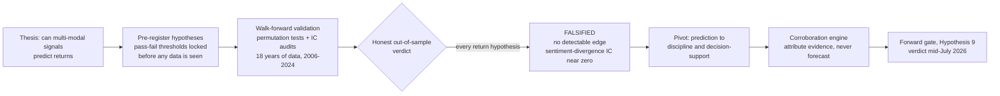
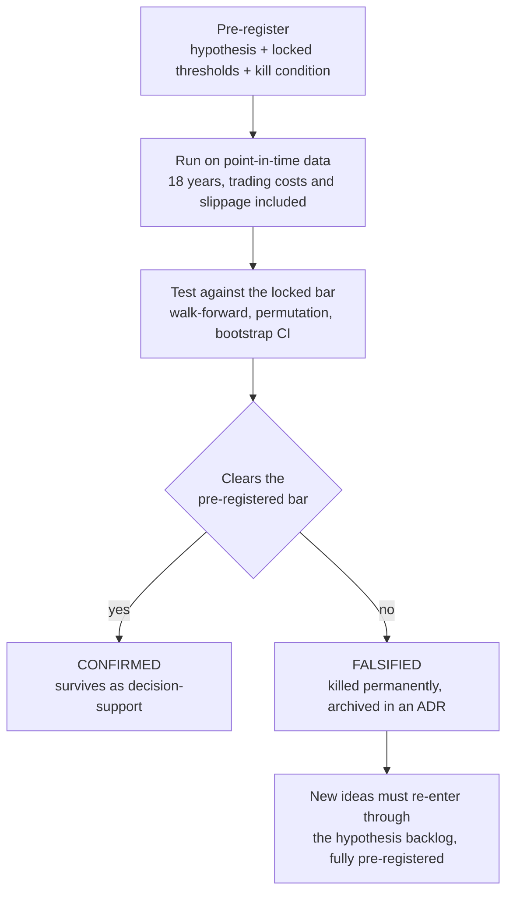
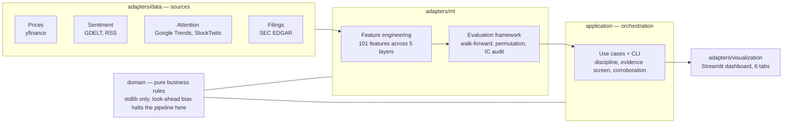

# Market Research Instrument

A weekly research cockpit for one family's portfolio. It flags risk concentrations,
tracks whether we follow our own discipline rules, and ranks stocks by factual evidence.
It does NOT predict returns — we tested that across 18 years of data and every idea
failed.

[](https://www.python.org/downloads/)
[](https://github.com/psf/black)
[](http://mypy-lang.org/)

---

## The arc

The project set out to beat the market, pre-registered its thesis, tried to kill it,
and watched it die honestly — then kept only what survived.



*We tried to kill our own thesis and it died. The rigor that killed it is the point.*

---

## The verdict table

Seven independent questions were tested. Each was pre-registered (meaning the
pass/fail bar was locked in writing before any data was examined). Results:

| Question | Answer | How we know |
|---|---|---|
| Does community conviction predict returns? | No | Pre-registered out-of-sample backtest, 2006–2024 ([ADR-039](docs/adr/039-conviction-validation-findings.md)) |
| Do conviction sub-dimensions carry signal? | No | Dimension-by-dimension IC audit ([ADR-043](docs/adr/043-conviction-dims-dead-divergence-led-surfacing.md)) |
| Does sentiment-vs-price divergence predict returns? | No | Cross-sectional IC, clean 430-ticker universe ([ADR-044](docs/adr/044-divergence-ic-verdict.md)) |
| Do momentum exits beat buy-and-hold? | No | Sharpe-difference bootstrap, CI spans zero ([ADR-046](docs/adr/046-momentum-discipline-phase1-verdict.md)) |
| Does the evidence screen's top decile outperform? | Unproven | Forward IC test, still accruing ([ADR-049](docs/adr/049-decision-support-engine-architecture.md)) |
| Does a trend-following sleeve clear its bar? | Unproven | Pre-registered backtest vs locked gate ([ADR-050](docs/adr/050-trend-following-sleeve-verdict.md)) |
| Do insider buying clusters predict returns? | Can't tell — too little clean data (treated as No) | Event study with survivorship-honest coverage guard ([ADR-053](docs/adr/053-insider-cluster-falsification-verdict.md)) |
| Does the discipline tool beat your own behavior? | Verdict ~mid-July 2026 | Live forward gate, thresholds locked in advance ([ADR-048](docs/adr/048-discipline-forward-calibration-gate.md), [ADR-051](docs/adr/051-calibration-readiness-date-diversity.md)) |

Every row above followed the same one-way pipeline. No threshold was ever moved after
a result was visible:



*Of the eight return hypotheses run, none cleared the bar; one forward gate is still open.*

---

## What the tool DOES do

The dashboard (Streamlit) is organised into six tabs. On first visit (local or
hosted) it always loads a bundled 10-stock **sample book** (`data/sample/`) —
never the operator's real holdings. Uploading your own CSV replaces it for that
browser session only (never written to disk); refreshing or opening a new tab
returns to the sample book. Stale Home/Screener artifacts can be refreshed
in-app via a gated "Run" button (single-flight, cooldown, disabled while fresh).

**Home** — a plain-English book-health summary: how many holdings need attention this
week, a gauge for how much of the book's movement is one market-wide bet, the latest
evidence-screen one-liner, and the discipline/gate status.

**Screener** — the weekly evidence screen (which clears the bar, or abstains when none
do), a history strip of past screens, and a *check-your-own-list* tool: paste tickers
or upload a CSV (capped at 25 names) and each name gets an evidence grade and a fit
check against your book.

**Risk** — the macro-beta scrubber: fits a simple statistical model to expose how much
of the portfolio's movement is really just one big bet on the overall market; as of
the last real-book run, 63% of variance was one market factor (66 names, mostly one
leveraged market bet).

**My Portfolio** — position tracking for the household's holdings.

**Stock Analysis** — for any stock you look up: the portfolio-fit verdict, an evidence
snowflake (valuation, quality, financial health vs the ~430-stock universe), and a
**Corroboration** section that surfaces external analyst claims harvested by the
corroboration engine — bucketed by source reliability (strong / moderate / weak),
with directional views by sector and a convergence badge on the verdict header.
A description of today, never a forecast.

**Trust** — the credibility wall: the full record of hypotheses tested with their
pre-registered thresholds and mechanically-executed kill decisions, the four rules
the project holds itself to, and a plain-English glossary. The underlying decisions
are archived in `docs/adr/` (ADRs 039–053); the portfolio-fit verdict's
honest-boundary design is recorded in [ADR-054](docs/adr/054-portfolio-fit-verdict.md).

The discipline forward-calibration gate (ADR-048) resolves in mid-July 2026 and will
tell us honestly whether the tool improved the household's adherence to its own rules.

---

## How to run it

```bash
# Install (uv)
uv sync
pre-commit install

# Launch the dashboard
streamlit run adapters/visualization/dashboard.py

# Run the Saturday discipline review job
bash scripts/discipline_weekly_review.sh

# Generate the weekly brief from the CLI
python -m application.cli weekly-brief --market us

# Corroboration pipeline (SP1+SP5 — runs weekly via launchd)
python -m application.cli corroborate                    # harvest + verify external claims
python -m application.cli surface-candidates             # surface STRONG/MODERATE tickers
python -m application.cli resolve-corroboration          # score resolved 21-day outcomes (SP5 gate)
python -m application.cli corroboration-calibration-status  # check SP5 forward-gate status

# Run tests (parallel, ~35s)
make test-fast

# Single-tab tests (fast iteration)
make test-tab tab=risk
```

---

## Glossary

Plain-English definitions for every term used in this project.

| Term | Meaning |
|------|---------|
| **Confidence interval (CI)** | The range the true average plausibly sits in. "CI low > 0" = even the pessimistic read is a profit. |
| **Slippage** | The hidden cost of trading a thinly-traded stock — your own order moves the price against you. |
| **Tercile** | Split into thirds. "Bottom liquidity tercile" = the third of stocks that are hardest to trade. |
| **Abnormal return** | A stock's return minus what a comparable index did over the same days — the part the stock did "on its own." |
| **IC (information coefficient)** | Correlation between a signal's ranking and what actually happened next. Zero = the signal knows nothing. |
| **Sharpe ratio** | Return earned per unit of risk taken. Higher is better — it rewards steady gains, not lucky volatile ones. |
| **Bootstrap** | Re-running a test on thousands of resampled versions of the data to see how much of the result is just luck. A confidence interval that "spans zero" means the edge could easily be nothing. |
| **Pre-registration** | Locking the test rules before seeing results, so you can't move the goalposts. |
| **Look-ahead bias** | Accidentally letting future data leak into a model — makes backtests look great and live trading fail. |
| **Systematic share** | How much of your book's movement is explained by broad market forces rather than your individual stock picks. |
| **Beta** | How much a stock (or your whole book) moves when the market moves. +1.00 = exactly with the market. |
| **Evidence grade** | Where a stock ranks on present-day facts (valuation, quality, health) versus the screened universe. A description, not a forecast. |
| **Net beta** | Your whole book's net sensitivity to the market after long and short positions offset each other. Zero = market-neutral. |
| **Universe** | The defined set of stocks the screen runs over. A stock not in the universe receives no evidence grade. |
| **Cleared the bar** | A stock passed every pre-registered gate (liquidity, data quality, minimum history) and entered the evidence screen. |
| **Abstention** | The screen declined to rank a stock — either because it failed a gate or because the evidence was too thin to be meaningful. |
| **Directional accuracy** | How often the up/down call matched what happened next. ~50% = no edge over a coin flip. |
| **Rank-IC** | Correlation between a signal's RANKING of stocks and the order of what happened next. Zero = the ranking knows nothing. |
| **Evidence screen** | The systematic pass over the universe that scores each stock on present-day factual data. It describes; it does not forecast. |
| **Trend filter** | A rule that checks whether a stock's price is above or below a long-run moving average, used to flag macro momentum context. |
| **Concentrated risk** | When a single position or a correlated cluster dominates the book's risk, so one bad outcome disproportionately hurts the whole. |
| **Reduce flag** | A signal to take some risk off a position — trim its size without exiting fully. |
| **Trim flag** | A signal to reduce the size of an existing holding, not to exit fully. |
| **Hold flag** | A signal that the current position size is appropriate — no action warranted. |
| **Add-on flag** | A signal that adding to an existing holding fits the book's current risk capacity. |
| **Book health** | A summary of whether the portfolio's diversification, liquidity, and factor exposures are within acceptable ranges. |
| **Momentum factor** | A stock characteristic based on its recent relative performance — stocks that have risen more than peers over a look-back window. |
| **Revision factor** | A stock characteristic based on how much third-party analyst earnings estimates have moved up or down recently. |
| **Quality factor** | A stock characteristic capturing profitability, earnings stability, and balance-sheet strength relative to peers. |
| **Value factor** | A stock characteristic based on how cheap a stock is relative to its fundamentals — e.g. low price-to-earnings or price-to-book. |
| **Industry percentile** | Where a stock ranks within its industry on a given metric, removing sector-level effects from the comparison. |
| **Analyst consensus** | The central tendency of third-party analyst estimates or ratings for a stock. Displayed as-sourced; this project does not adopt it. |
| **Dispersion** | The spread among third-party analyst estimates — wide dispersion signals high uncertainty about the stock's near-term path. |
| **Snowflake** | A radar-chart visual showing a stock's scores across multiple factor dimensions at once. |
| **Portfolio fit** | An assessment of how well a stock complements the existing book — factoring in beta overlap, concentration, and liquidity. |
| **EMH** | Efficient-Market Hypothesis: public information is already in the price, so a public signal rarely beats the market on its own. |
| **SMA-200** | The 200-day simple moving average of a stock's closing price — a widely watched long-run trend reference level. |
| **Falsified** | A hypothesis that was pre-registered and then failed its gate when tested on real data. Honest accounting of what did not work. |

---

## Architecture

Hexagonal (ports and adapters): the core business logic in `domain/` has zero
external library imports. Any data source, ML model, or dashboard can be swapped
without touching the rules.



*Data flows left to right; every dependency points inward to a domain that imports nothing.*

```
domain/                          # Pure business logic (stdlib only)
  models.py                      # Signal, Sentiment, BuzzSignal, Holding, ...
  ports.py                       # MarketDataPort, SentimentPort, HoldingsPort, ...
  services.py                    # Grading, leakage detection, freshness
  exceptions.py                  # LookAheadBiasError, InsufficientDataError
  fit.py                         # Portfolio-fit verdict (evidence grade + fit flags)

adapters/
  data/                          # yfinance, RSS, Google Trends, StockTwits, GDELT,
                                 #   SEC EDGAR, SQLite store
  ml/                            # Feature engineers (101 features across 5 layers),
                                 #   XGBoost/LightGBM/Ridge/ensemble predictors,
                                 #   macro-beta Ridge estimator
  visualization/                 # Streamlit dashboard (multi-tab), data loader,
                                 #   chart builders, CSS components

application/
  cli/                           # Click CLI package (38 commands across 8 modules)
    _cli_group.py                #   Click group entry point
    _deps.py                     #   Shared dependency builder + helpers
    *_commands.py                #   One file per command domain (~300-500 LOC each)
  weekly_brief_use_case.py       # Weekly brief orchestration
  macro_beta_use_case.py         # Book macro-factor exposure
  fit_use_case.py                # Portfolio-fit verdict input gathering
  evidence_screen_use_case.py    # Evidence screen (RESEARCH_ONLY, never a predictor)
  discipline_use_case.py         # Discipline / adherence tracking

config/
  markets/us.yaml                # US market configuration + locked gate thresholds
  tickers/sp500.txt              # ~503 S&P 500 constituents
  tickers/nasdaq100.txt          # ~101 NASDAQ-100 constituents
```

**Dependency rule:** All arrows point inward. `domain/` imports nothing from
`adapters/` or `application/`. Swapping a data source means writing a new adapter,
never touching business rules.

---

## The story

This project started as an attempt to beat the market using public data. The core
hypothesis was that when news sentiment and stock prices disagree — one bullish, the
other falling — that divergence predicts which way the price would resolve. A
reasonable idea. It was wrong.

Seven independent tests were run across 18 years of price history (2006–2024), each
with the exact pass/fail bar written down and locked before the data was examined.
Conviction signals: no edge. Sentiment divergence: no edge. Momentum exits: no edge
(the confidence interval on the improvement straddled zero — meaning the observed
gain could easily be noise). Insider buying clusters: the result was
"INCONCLUSIVE_THIN_COVERAGE" — 46.6% of the 28,866 events in the study had no
usable price history because those companies had since been delisted. The coverage
guard counted every unpriceable event against the test rather than silently dropping
it; that honest accounting fired the kill switch.

Why trust the kills? Three reasons. First, all thresholds were pre-registered — no
goalpost moved after the result was visible. Second, point-in-time discipline was
enforced in code: any prediction that accidentally touched future data raised a
`LookAheadBiasError` and halted the pipeline. Third, trading costs were included
in every backtest; a signal that looks profitable before costs and disappears after
them is not an edge, and we modeled the real cost of trading thinly-traded stocks
(called slippage).

What survived is not a predictor — it is a cockpit. The macro-beta scrubber showed
that the real family portfolio was, at the time of analysis, 63% driven by a single
market factor: 66 positions that looked diversified were mostly one leveraged market
bet. That finding is actionable and requires no forecasting. The discipline tracker
surfaces whether stated investment rules are actually followed week to week; that gap
between intention and behavior is the honest problem the tool now addresses. The
evidence screen ranks stocks by factual, point-in-time metrics (valuation, quality,
financial health) and explicitly labels its output RESEARCH_ONLY — it does not
recommend buying or selling.

The forward calibration gate (ADR-048) is the one open verdict: a pre-registered
test of whether the discipline tool improves adherence, resolving mid-July 2026. The
thresholds were locked before any live data accrued. The result will be reported
honestly, whatever it is.

For a recruiter: this project demonstrates pre-registered hypothesis testing, rigorous
negative-result reporting, point-in-time enforcement as a code invariant, hexagonal
architecture applied to a real data pipeline, and 2,392 tests covering domain logic,
adapters, use cases, and integration paths. The negative findings are the portfolio
piece — a system that falsified its own thesis honestly is more credible than one that
never tested it.

---

## Setup

### Prerequisites

- Python 3.12+
- Conda (recommended)

### Installation

```bash
git clone https://github.com/tirthjoship/research-instrument.git
cd research-instrument

conda create -n research-instrument python=3.12 -y
conda activate research-instrument

pip install -e ".[dev,dashboard]"
pre-commit install
```

### Verify

```bash
# Full suite (1628 tests, ~28 s)
pytest tests/ -q

# With coverage gate (90% required)
pytest tests/ --cov=domain --cov=adapters --cov=application --cov-fail-under=90

# Full quality check (lint + type-check + tests)
make check
```

---

## Risk disclaimer

This project is for educational and research purposes only. Nothing generated by this
system is financial advice. Past performance does not guarantee future results. Always
consult a licensed financial advisor before making investment decisions.

---

## Author

**Tirth Joshi** — UBC Master of Data Science

---

## License

MIT License. See `LICENSE` file for details.
