# Risk Tab — Fix Brief (Claude Code target doc)

**Purpose:** Living spec for incremental Risk-tab fixes. Built interactively with Tirth; each item has current state, desired state, and screenshots.

**Handoff for Claude Code:** `docs/fix-targets/HANDOFF-risk-tab-fixes.md` ← **start there**

**Project:** `ML_Portfolio_Projects/multi-modal-stock-recommender`
**Tab:** Risk (`adapters/visualization/tabs/risk.py`)
**Status:** ✅ **Ready for Claude Code** — 9 items documented (R01–R08 open, R09 done) — session closed 2026-06-16
**Mockup of record:** `docs/superpowers/mockups/risk-v8.html`
**Prior build spec:** `docs/superpowers/specs/2026-06-15-risk-tab-redesign-design.md`

---

## How Claude Code should use this doc

1. Read this file top-to-bottom before touching code.
2. Fix items **in priority order** (P0 → P1 → P2) unless a dependency forces reordering.
3. For each item: match **Desired state**; use screenshots as visual truth when text is ambiguous.
4. Key files:
   - Render: `adapters/visualization/tabs/risk.py` (~1,460 lines, v8 layout)
   - Data: `data/personal/brief_summary.json` → `macro` dict
   - Second opinion: `adapters/visualization/components/risk_second_opinion.py`, `application/risk_second_opinion.py`
   - Stats: `domain/risk_stats.py`, `adapters/ml/risk_stats_analyzer.py`
5. Rails (non-negotiable): ADR-052 honesty rails, no FORBIDDEN_WORDS, dials = heuristic not edge, sector gaps descriptive only, Google AI attributed + local-only.
6. Verify: `make check` green; eyeball Risk tab with `STOCKREC_LOCAL_ONLY=1 streamlit run adapters/visualization/dashboard.py`.

---

## Screenshot folder

All screenshots live here (repo root: `multi-modal-stock-recommender/`):

```
docs/fix-targets/screenshots/risk-tab/
```

Naming convention: `{item-id}-{current|desired|other}-{short-label}.png`

**Markdown embeds (use this — validated for Cursor preview):** paths are **relative to this file** (`docs/fix-targets/`):

```markdown
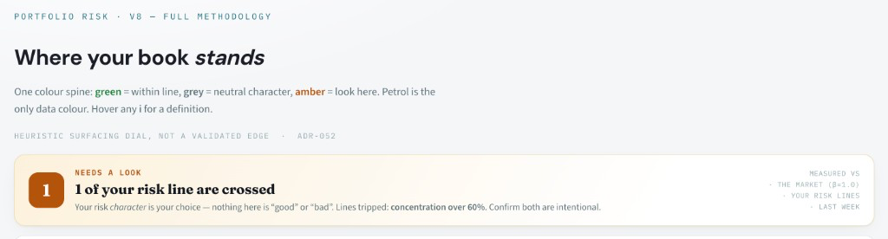
```

### Screenshot inventory (validated 2026-06-16)

| File | Item | Role | Embedded in doc |
|------|------|------|-----------------|
| `R01-current-header-status-banner.png` | R01 | Current | Yes |
| `R01-desired-header-status-banner.png` | R01 | Desired | Yes |
| `R02-current-lens-nav-beans.png` | R02 | Current | Yes |
| `R02-target-section-standing.png` | R02 | Scroll target | Yes |
| `R02-target-section-dials.png` | R02 | Scroll target | Yes |
| `R02-target-section-teach.png` | R02 | Scroll target | Yes |
| `R03-current-factor-chart-4-factors.png` | R03 | Current | Yes |
| `R03-desired-factor-chart-9-factors.png` | R03 | Desired | Yes |
| `R03-desired-correlation-vif-callout.png` | R03 | Desired detail | Yes |
| `R03-desired-read-summary-line.png` | R03 | Desired detail | Yes |
| `R04-current-enb-dropdown-flat.png` | R04 | Current | Yes |
| `R04-desired-enb-dropdown-bin.png` | R04 | Desired | Yes |
| `R05-current-who-owns-header.png` | R05 | Current | Yes |
| `R05-desired-who-owns-tooltip.png` | R05 | Desired | Yes |
| `R06-current-who-owns-holdings-wrap.png` | R06 | Current | Yes |
| `R06-desired-who-owns-holdings-inline.png` | R06 | Desired | Yes |
| `R07-desired-google-ai-second-opinion.png` | R07 | Desired | Yes |
| `R08-current-teach-walkthrough-flat.png` | R08 | Current | Yes |
| `R08-desired-teach-walkthrough-bin.png` | R08 | Desired | Yes |
| `R09-current-per-tab-refresh-button.png` | R09 | Current (remove) | Yes |

**20 / 20 files on disk · 20 / 20 embedded · all valid PNG**

---

## Summary table

| ID | Section | Priority | Status | Screenshot(s) |
|----|---------|----------|--------|---------------|
| R01 | Header + status banner (top of tab) | P0 | 🔴 Open — desired recorded | current + desired PNGs |
| R02 | Lens nav beans → in-tab anchor scroll | P0 | 🔴 Open — desired recorded | beans + 3 target section PNGs |
| R03 | Factor chart — 9 factors + labels + VIF callout + READ line | P0 | 🔴 Open — investigation recorded | current 4-factor + mockup 9-factor PNGs |
| R04 | ENB drill-down dropdown — card/bin container + padding | P1 | 🔴 Open — desired recorded | current flat vs mockup bin PNGs |
| R05 | Who owns the bet — section separator + ⓘ tooltip | P1 | 🔴 Open — desired recorded | current header + mockup tooltip PNGs |
| R06 | Who owns the bet — holdings row values layout | P1 | 🔴 Open — desired recorded | current wrap vs mockup inline PNGs |
| R07 | Second opinion · Google AI panel (above Teach me) | P0 | 🔴 Open — missing in live app | desired mockup PNG |
| R08 | Plain-English walkthrough — bin + donut + live copy | P1 | 🔴 Open — desired recorded | current flat vs mockup bin PNGs |
| R09 | Remove per-tab `↻ refresh` button (all tabs) | P2 | 🟢 Done — removed in `dashboard.py` | current screenshot |

---

## Items

### R01 — Header + status banner (top of tab)

**Priority:** P0
**Status:** 🔴 Open — current + desired recorded 2026-06-16
**Code:** `_header()` + `_status_banner()` in `adapters/visualization/tabs/risk.py`
**Mockup ref:** `docs/superpowers/mockups/risk-v8.html` (lines 137–146 for this section)
**Data:** `macro["flags"]` from `data/personal/brief_summary.json`

#### Screenshots

| | Repo path |
|---|------|
| **Current** | `docs/fix-targets/screenshots/risk-tab/R01-current-header-status-banner.png` |
| **Desired (mockup)** | `docs/fix-targets/screenshots/risk-tab/R01-desired-header-status-banner.png` |

**Current — live app (2026-06-16, 6:44 PM):**


**Desired — mockup target (2026-06-16, 6:53 PM):**

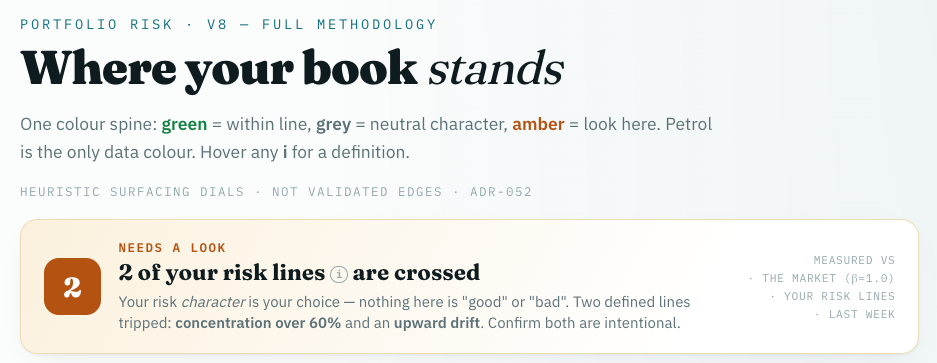

#### Current state (as of 2026-06-16 screenshot)

**Header block (`_header`)**

- Eyebrow (IBM Plex Mono, petrol/teal, uppercase): `PORTFOLIO RISK · V8 — FULL METHODOLOGY`
- H1 (Fraunces): **Where your book *stands*** (italic on "stands")
- Lede (grey, 14px): colour-spine explainer — green = within line, grey = neutral character, amber = look here; petrol = only data colour; hover **i** for definitions
- ADR footnote (mono, faint, uppercase): `HEURISTIC SURFACING DIAL, NOT A VALIDATED EDGE · ADR-052`

**Status banner (`_status_banner`) — amber / "Needs a look" state** *(1 flag crossed)*

- Layout: horizontal card, cream/amber-tinted background, rounded corners
- Left: amber square badge with white **1**
- Centre:
  - Sk label: `NEEDS A LOOK` (amber, uppercase mono)
  - Headline: **1 of your risk line are crossed** ← grammar bug: singular "line" + plural "are"
  - Detail: *Your risk character is your choice — nothing here is "good" or "bad".* Lines tripped: **concentration over 60%**. Confirm **both** are intentional. ← copy bug: says "both" when only 1 line tripped
- Right rail (mono, faint, right-aligned): `MEASURED VS · THE MARKET (β=1.0) · YOUR RISK LINES · LAST WEEK`

**Live data in this screenshot**

- Flag fired: concentration over 60%
- Banner count: 1

#### Desired state (from mockup — 2026-06-16)

**1. Title typography — match mockup**

- H1 **Where your book *stands*** must use mockup fonts/sizing:
  - Font: **Fraunces** serif (`font-weight: 900`, `font-size: 38px`, `line-height: 1.04`, `letter-spacing: -0.02em`)
  - *stands* in italic with **`font-weight: 400`** (lighter italic, not bold-italic)
- Reference: mockup `.h1` / `.h1 .it` in `risk-v8.html`

**2. Remove "v8" from eyebrow**

- **Current:** `PORTFOLIO RISK · V8 — FULL METHODOLOGY`
- **Desired:** `PORTFOLIO RISK · FULL METHODOLOGY` (drop "v8 —" entirely)
- Code today: `_header()` line ~88

**3. Remove ADR-052 from this page**

- **Current:** footer line ends with `· ADR-052`
- **Desired:** `HEURISTIC SURFACING DIALS · NOT VALIDATED EDGES` — **no ADR-052 anywhere on the Risk tab**
- Note: ADR-052 honesty *rails* still apply in code/tests; just don't surface the ADR label in UI copy
- Mockup also uses plural "dials" / "edges" (not singular "dial" / "edge")

**4. Status banner — add drift to detail copy**

- **Current detail (1 flag):** *Your risk character is your choice…* Lines tripped: **concentration over 60%**. Confirm both are intentional.
- **Desired detail (when drift flag fires):** *Your risk character is your choice — nothing here is "good" or "bad".* **Two defined lines tripped:** **concentration over 60%** and an **upward drift**. Confirm both are intentional.
- Drift text comes from `_flag_short("DRIFT")` → `"upward drift"` (already in code); banner detail must **join all active flags** dynamically (mockup shows 2-flag case)
- Copy pattern by count:
  - `n == 1`: *One defined line tripped: **{flag}**.* Confirm it is intentional.
  - `n == 2`: *Two defined lines tripped: **{flag1}** and an **{flag2}**.* Confirm both are intentional.
  - `n >= 3`: *{n} defined lines tripped: **{flags…}**.* Confirm all are intentional.

**Also match mockup (same section, implied by desired screenshot):**

- Headline: `{n} of your risk lines` + **ⓘ tooltip** + `are crossed` (grammar fix; tooltip explains what a risk line is — see mockup `.info` on headline)
- Status banner headline uses same Fraunces styling as mockup `.sv`

#### Notes / constraints

- Green "All clear" variant exists when `flags` is empty — not shown in either screenshot
- Live app currently has 1 flag (`concentration over 60%`); mockup illustrates 2-flag case for copy/layout reference
- Honesty rails still apply: no good/bad grading of risk character; drift mention is descriptive only

#### Acceptance criteria

- [ ] H1 matches mockup Fraunces weight/size; *stands* is italic weight 400
- [ ] Eyebrow reads `Portfolio Risk · full methodology` (no "v8")
- [ ] No `ADR-052` string rendered anywhere on Risk tab
- [ ] ADR footnote reads `Heuristic surfacing dials · not validated edges` (plural, no ADR suffix)
- [ ] Status banner detail lists all tripped flags including **upward drift** when `DRIFT` is in `flags`
- [ ] Singular/plural copy correct for 1 vs 2+ flags ("line is" / "lines are"; "Confirm it" / "Confirm both")
- [ ] Headline includes ⓘ tooltip on "risk lines" per mockup
- [ ] Side-by-side eyeball vs `R01-desired-header-status-banner.png`

---

### R02 — Lens nav beans → scroll to section headings

**Priority:** P0
**Status:** 🔴 Open — current + scroll targets recorded 2026-06-16
**Code:** `_lens_nav()` (beans) + section headings in `_standing()`, `_dials()`, `_teach()`
**Mockup ref:** `risk-v8.html` lines 166–169 (working `<a href="#…">` links)

#### Screenshots

| | Repo path |
|---|------|
| **Current (beans — non-functional)** | `docs/fix-targets/screenshots/risk-tab/R02-current-lens-nav-beans.png` |
| **Scroll target 1** | `docs/fix-targets/screenshots/risk-tab/R02-target-section-standing.png` |
| **Scroll target 2** | `docs/fix-targets/screenshots/risk-tab/R02-target-section-dials.png` |
| **Scroll target 3** | `docs/fix-targets/screenshots/risk-tab/R02-target-section-teach.png` |

**Current — lens nav beans (placeholders, no scroll):**

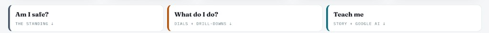

**Desired scroll targets — section headings further down the tab:**

| Bean click | Lands on this heading |
|------------|----------------------|
| **Am I safe?** | 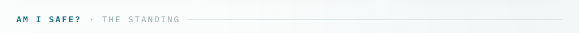 |
| **What do I do?** |  |
| **Teach me** | 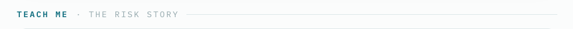 |

#### Current state

Three lens-nav cards render after vitals (`_lens_nav()`), styled correctly but **not wired**:

- Cards are `<a>` tags with **no `href`** — clicking does nothing
- Bean labels:
  1. **Am I safe?** / `THE STANDING ↓` (left accent: grey)
  2. **What do I do?** / `DIALS + DRILL-DOWNS ↓` (left accent: amber)
  3. **Teach me** / `STORY + GOOGLE AI ↓` (left accent: petrol)

**Target section headings already exist in the HTML** (with `id` attributes), but beans don't link to them:

| `id` | Rendered by | Section heading text |
|------|-------------|----------------------|
| `#safe` | `_standing()` | `Am I safe? · The standing` |
| `#do` | `_dials()` | `What do I do? · The dials` |
| `#teach` | `_teach()` | `Teach me · The risk story` |

#### Desired state

Clicking each bean **smooth-scrolls** the Risk tab to the matching section heading (same question phrase, dot separator):

| Bean (click) | Scroll to `id` | Section heading (must be visible at top of viewport) |
|--------------|----------------|------------------------------------------------------|
| **Am I safe?** | `#safe` | `AM I SAFE? · THE STANDING` |
| **What do I do?** | `#do` | `WHAT DO I DO? · THE DIALS` |
| **Teach me** | `#teach` | `TEACH ME · THE RISK STORY` |

**Implementation notes for Claude Code:**

- Mockup uses plain `href="#safe"`, `href="#do"`, `href="#teach"` on `.lens` anchors
- Add `href` to each bean in `_lens_nav()` to match mockup
- **Streamlit gotcha:** native `#anchor` links inside `st.markdown(unsafe_allow_html=True)` often fail to scroll (iframe / nested scroll container). If `href` alone doesn't work in live app, add a small JS handler (pattern: `tab_loading.py` injects JS via `components.html` or inline script) using `document.getElementById(id).scrollIntoView({behavior:'smooth', block:'start'})` on bean click
- Bean sublabels (`THE STANDING`, `DIALS + DRILL-DOWNS`, `STORY + GOOGLE AI`) are **nav hints** — scroll target is the section heading with the matching question phrase, not the sublabel text literally
- Preserve hover lift styling from mockup (`.lens:hover { transform: translateY(-2px) }`)

#### Acceptance criteria

- [ ] Click **Am I safe?** → viewport scrolls to `#safe` / "Am I safe? · The standing"
- [ ] Click **What do I do?** → viewport scrolls to `#do` / "What do I do? · The dials"
- [ ] Click **Teach me** → viewport scrolls to `#teach` / "Teach me · The risk story"
- [ ] Works in live Streamlit app (not just static HTML mockup)
- [ ] Beans remain styled as today (3 cards, coloured left accent, Fraunces question + mono sublabel)

---

### R03 — Factor chart (`What's driving it · N factors`)

**Priority:** P0
**Status:** 🔴 Open — current + desired + root-cause investigation recorded 2026-06-16
**Code:** `_factor_chart()` in `adapters/visualization/tabs/risk.py`
**Config:** `config/markets/us.yaml` → `macro_beta.factors`
**Data:** `macro` in `data/personal/brief_summary.json` (`net_beta_by_factor`, `vif_by_factor`, `suppressed_factors`, `dominant_factor`)
**Mockup ref:** `risk-v8.html` lines 224–238

#### Screenshots

| | Repo path |
|---|------|
| **Current (live — 4 factors)** | `docs/fix-targets/screenshots/risk-tab/R03-current-factor-chart-4-factors.png` |
| **Desired (mockup — 9 factors)** | `docs/fix-targets/screenshots/risk-tab/R03-desired-factor-chart-9-factors.png` |
| **Desired — VIF correlation callout** | `docs/fix-targets/screenshots/risk-tab/R03-desired-correlation-vif-callout.png` |
| **Desired — READ summary line** | `docs/fix-targets/screenshots/risk-tab/R03-desired-read-summary-line.png` |

**Current — live app (4 factors, sparse labels):**

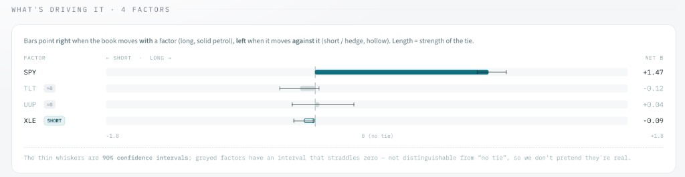

**Desired — mockup (9 factors, full insights):**

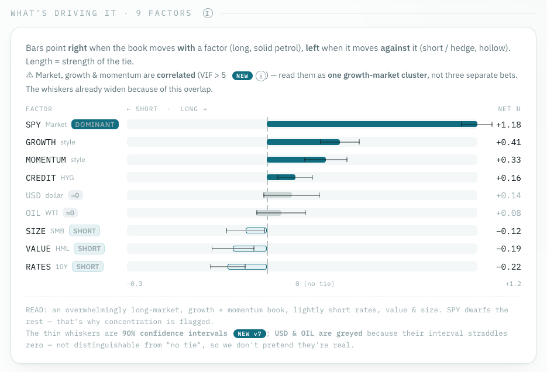

**Desired detail crops:**

| VIF callout | READ line |
|-------------|-----------|
| 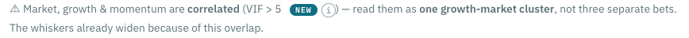 | 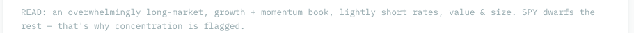 |

#### Current state

**What renders today (`_factor_chart`):**

- Section title: `WHAT'S DRIVING IT · 4 FACTORS` (dynamic count — correct)
- Intro lede about bar direction (long/short/hollow) — present
- **4 factor rows only:** SPY (+1.47), TLT (−0.12, ≈0 greyed), UUP (+0.04, ≈0 greyed), XLE (−0.09, **SHORT**)
- Whiskers + axis labels present
- Footer: whisker/CI explanation only — **no READ summary line**
- **No VIF / correlation callout** visible in live render

**What's partially implemented in code but not showing:**

| Feature | Code status | Why not visible live |
|---------|-------------|----------------------|
| `[DOMINANT]` badge | Exists — triggers on `vif > 5` | Live VIF all ~1.0–1.2 (`brief_summary.json`); SPY is `dominant_factor` but badge logic ignores that field |
| `[SHORT]` badge | Works | XLE shows SHORT ✓ |
| `≈0` suppressed badge | Works | TLT, UUP greyed ✓ |
| VIF correlation callout | `_factor_chart` builds `vif_note` when any VIF > 5 | No factor has VIF > 5 with current 4-factor config |
| READ summary line | **Not implemented** | Mockup `.fnote` block missing from `_factor_chart()` entirely |
| Factor subtitles | **Not implemented** | Mockup shows `SPY Market`, `GROWTH style`, `RATES 10Y`, etc. — live shows ticker only |

#### Root cause — why only 4 factors (investigation)

**Primary cause: config, not a render bug.**

```yaml
# config/markets/us.yaml (line 43)
macro_beta:
  factors: [SPY, TLT, UUP, XLE]   # market / rates / dollar / energy-equity
```

Live `brief_summary.json` confirms the scrubber only fits these 4:

```json
"factors": ["SPY", "TLT", "UUP", "XLE"]
```

**Mockup illustrates 9 factors** (with ETF proxies):

| Mockup factor | Subtitle | Likely ETF proxy |
|---------------|----------|------------------|
| SPY | Market | SPY |
| GROWTH | style | MTUM or IWF? |
| MOMENTUM | style | MTUM |
| CREDIT | HYG | HYG |
| USD | dollar | UUP |
| OIL | WTI | USO or XLE |
| SIZE | SMB | IWM |
| VALUE | HML | VLUE or IWD |
| RATES | 10Y | TLT |

Spec note (`2026-06-15-risk-tab-redesign-design.md`): tab must render **whatever config fits**, not hardcode 9 — but expanding the factor universe is a **separate config + pipeline decision** (needs grill/ADR if pursued). UI work and config expansion may be two sub-tasks.

**Secondary cause — VIF callout absent:** the 4 configured factors (market/rates/dollar/energy) are relatively orthogonal → all VIF ≈ 1.1. The mockup's correlated cluster (market + growth + momentum, VIF > 5) only appears with a richer, overlapping factor set.

#### Desired state

Match mockup descriptiveness at the correct factor count (target: **9 factors** if config expanded):

**1. Expand factor universe (config + scrubber)**

- Investigate and add factor ETF proxies to `macro_beta.factors` in `us.yaml` (or market-appropriate config)
- Re-run `weekly-brief` so `brief_summary.json` populates all 9 betas, CIs, VIFs
- Confirm scrubber handles correlated factors without failure

**2. Per-factor highlight badges (like mockup)**

| Badge | When | Example |
|-------|------|---------|
| `[DOMINANT]` | Factor with largest \|net β\| — use `macro["dominant_factor"]` | SPY |
| `[SHORT]` | Negative β, not suppressed | SIZE, VALUE, RATES |
| `≈0` | In `suppressed_factors` (CI straddles zero) | USD, OIL |

- Fix DOMINANT logic: currently VIF-based; should align with `dominant_factor` field (mockup puts DOMINANT on SPY because it dwarfs the rest, not because VIF > 5)

**3. VIF / correlation callout (missing today)**

When any factor has VIF > 5, show the mockup warning block:

> ⚠ Market, growth & momentum are **correlated** (VIF > 5 ⓘ) — read them as **one growth-market cluster**, not three separate bets. The whiskers already widen because of this overlap.

- Human-readable cluster names, not raw ticker list
- Include VIF tooltip (already partially wired via `tooltip("VIF")`)

**4. READ summary line (missing today)**

Add mockup `.fnote` block after factor rows:

> READ: an overwhelmingly long-market, growth + momentum book, lightly short rates, value & size. SPY dwarfs the rest — that's why concentration is flagged.

- Generate dynamically from live betas (long/short/suppressed factors + `dominant_factor` + active flags)
- Keep whisker footnote below READ line (mockup combines both in `.fnote`)
- No FORBIDDEN_WORDS; descriptive only

**5. Factor display names**

- Show ticker + human subtitle like mockup: `SPY Market`, `GROWTH style`, `RATES 10Y`
- Requires a factor display-name map (config or domain constant)

#### Acceptance criteria

- [ ] Factor count matches expanded config (target 9 per mockup, or document honest count if fewer)
- [ ] `[DOMINANT]` on `dominant_factor` (SPY in live book)
- [ ] `[SHORT]` on all negative non-suppressed factors
- [ ] `≈0` on suppressed factors (CI straddles zero)
- [ ] VIF > 5 callout renders with human-readable cluster copy when correlated factors exist
- [ ] READ summary line renders below factor chart, dynamically generated from live data
- [ ] Whiskers footnote retained (can merge into same `.fnote` block as mockup)
- [ ] Side-by-side eyeball vs `R03-desired-factor-chart-9-factors.png`
- [ ] `make check` green; existing `test_risk_tab_vif_collinear_note` still passes

---

### R04 — ENB drill-down (`What are my ~N bets, and how do I raise it?`)

**Priority:** P1
**Status:** 🔴 Open — current + desired recorded 2026-06-16
**Code:** `_enb_section()` → `<details class="teach">` block in `adapters/visualization/tabs/risk.py` (~lines 948–988)
**Styles:** `adapters/visualization/components/styles.py` (`.teach` CSS **missing** — see investigation)
**Mockup ref:** `risk-v8.html` lines 252–266, CSS lines 100–101 + `.act` / `.levers`

#### Screenshots

| | Repo path |
|---|------|
| **Current (flat — no card/bin)** | `docs/fix-targets/screenshots/risk-tab/R04-current-enb-dropdown-flat.png` |
| **Desired (mockup — proper bin)** | `docs/fix-targets/screenshots/risk-tab/R04-desired-enb-dropdown-bin.png` |

**Current — live app (looks like bare collapsible tab):**

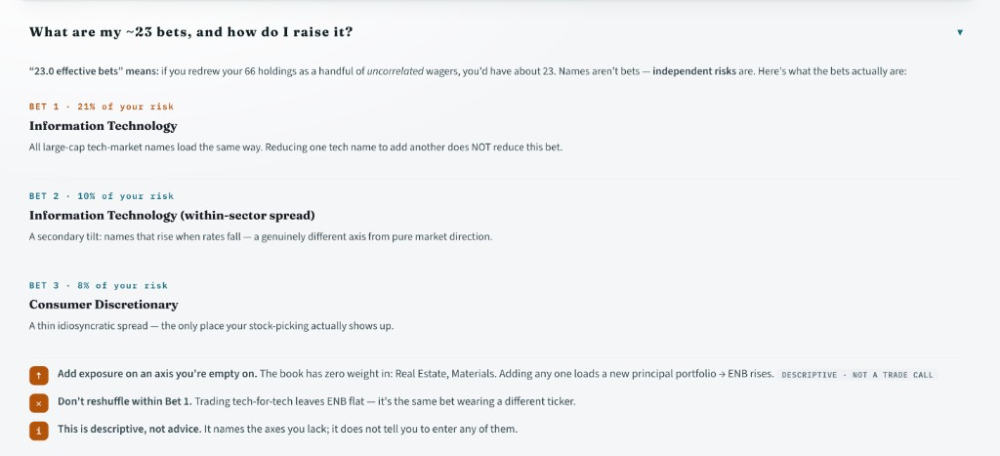

**Desired — mockup (self-contained card with padding + separators):**

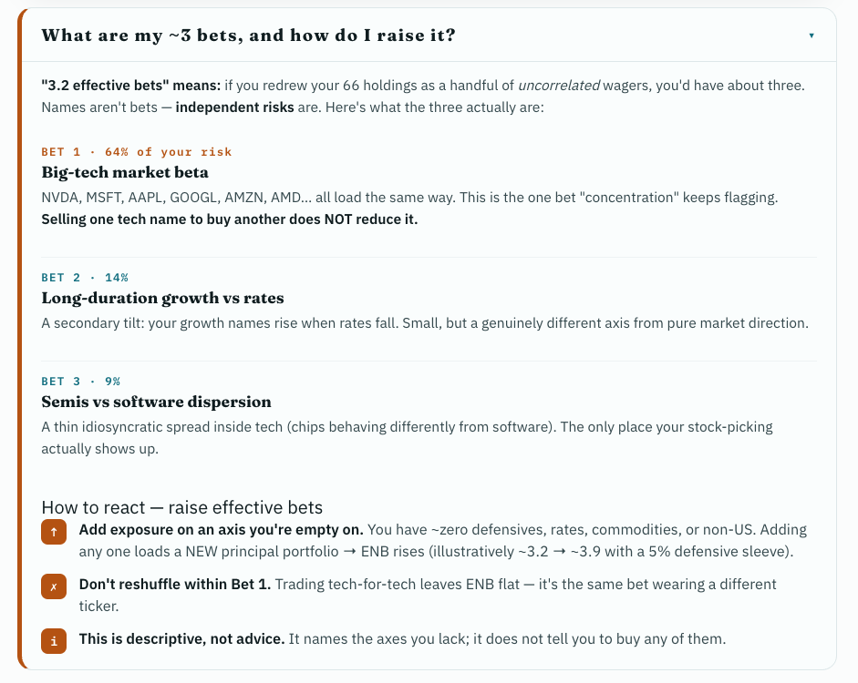

#### Current state

The ENB expandable drill-down (`<details class="teach">`) renders the right **content** (bet list, sector gaps, how-to-raise actions) but **wrong chrome**:

- No visible card/bin around the dropdown — content sits flush on the page background
- Looks like a plain HTML `<details>` collapsible, not a designed panel
- Thin horizontal lines between bets only; no enclosing container
- "How to react" action rows (↑, ✗, i) float without a sub-section bin
- Summary row has minimal separation from body when expanded
- ENB number differs live (~23) vs mockup (~3) — **that's data, not a layout bug**

**Code today:** `_enb_section()` uses `class="teach"` + inline styles on `<summary>`, body wrapped in `<div style="padding:4px 17px 14px">`.

#### Root cause (investigation)

Mockup CSS for `.teach`, `.tbody`, `.chap`, `.act`, `.levers` lives in `risk-v8.html` but was **never ported** to `styles.py`. The HTML references `class="teach"` expecting:

```css
/* risk-v8.html — NOT in styles.py today */
.teach {
  border: 1px solid var(--line);
  border-left: 4px solid var(--petrol);  /* ENB uses amber override */
  border-radius: 13px;
  background: #fafdfd;
  overflow: hidden;
}
.teach[open] summary { border-bottom: 1px solid var(--line); }
.tbody { padding: 4px 17px 14px; }
```

Without this, Streamlit renders an unstyled `<details>` element.

#### Desired state

The dropdown should be a **self-contained card/bin** (like mockup), not a naked collapsible:

**Outer bin (`<details class="teach">`):**
- `border: 1px solid` + `border-radius: 13px` + light background (`#fafdfd` or `var(--risk-card)`)
- **Left accent bar:** 4px amber (`var(--risk-amber)`) — ENB drill uses amber, not petrol
- `overflow: hidden` so corners clip cleanly
- Subtle box-shadow (match `.risk-enb` card above it)

**Summary row (clickable header):**
- Padding `14px 17px` inside the bin
- Fraunces title: `What are my ~{enb} bets, and how do I raise it?`
- Chevron `▾` on the right
- When open: `border-bottom: 1px solid` separator between header and body

**Body (`.tbody`):**
- Consistent padding `4px 17px 14px` (or mockup's `14px 16px` for drillbody)
- Intro paragraph, then bet chapters with `border-bottom` dividers
- Bet rows: `BET N · X% of your risk` label + Fraunces title + description

**"How to react" sub-bin (`.levers`):**
- Separate inner container below the bet list
- Left accent border (amber)
- Header: `How to react — raise effective bets`
- Three `.act` rows with amber icon squares (↑, ✗, i) — already in HTML, needs CSS

**Port from mockup to `styles.py`:**
- `.teach`, `.teach summary`, `.teach[open] summary`, `.tbody`
- `.chap`, `.cnum`, `.cq`, `.ans`
- `.levers`, `.lvh`, `.act`, `.act .ic`

Or inline the critical card styles on the `<details>` if porting to `styles.py` is deferred — but prefer shared CSS class like other risk-tab components.

#### Notes / constraints

- Scope is **layout/chrome only** — bet names, ENB value, sector gaps come from live `macro` data
- Keep `<details>` / `<summary>` for native expand/collapse (don't replace with JS unless needed)
- Honesty tags (`DESCRIPTIVE · NOT A TRADE CALL`) stay as-is
- Match visual weight of the `.risk-enb` hero card directly above this dropdown

#### Acceptance criteria

- [ ] Dropdown has visible card/bin: border, radius, background, left amber accent
- [ ] Summary and body have proper internal padding (not flush to page edge)
- [ ] Open state shows header/body separator line
- [ ] Bet chapters separated inside the bin (not floating on page background)
- [ ] "How to react" section in its own sub-container with header + icon rows
- [ ] Does not look like a bare Streamlit/HTML collapsible tab
- [ ] Side-by-side eyeball vs `R04-desired-enb-dropdown-bin.png`

---

### R05 — Who owns the bet (section header + tooltip)

**Priority:** P1
**Status:** 🔴 Open — current + desired recorded 2026-06-16
**Code:** `_who_owns()` in `adapters/visualization/tabs/risk.py` (~lines 1190–1195)
**Glossary:** `tooltip("Risk contribution")` in `adapters/visualization/components/glossary.py` (already defined)
**Mockup ref:** `risk-v8.html` line 281

#### Screenshots

| | Repo path |
|---|------|
| **Current (no tooltip, weak separator)** | `docs/fix-targets/screenshots/risk-tab/R05-current-who-owns-header.png` |
| **Desired (ⓘ cloud + proper header line)** | `docs/fix-targets/screenshots/risk-tab/R05-desired-who-owns-tooltip.png` |

**Current — live app:**

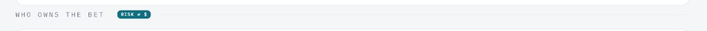

**Desired — mockup (hover cloud on ⓘ):**

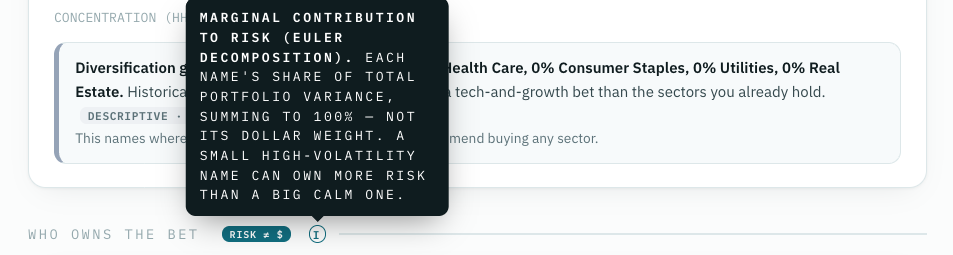

#### Current state

Section header renders as:

```
WHO OWNS THE BET  [RISK ≠ $]
─────────────────────────────  (thin line, minimal spacing)
```

- `RISK ≠ $` petrol badge present ✓
- **No ⓘ tooltip** — glossary entry exists (`"Risk contribution"`) but `_who_owns()` never calls `tooltip()`
- Separator line feels weak / cramped — little vertical margin above/below the header row
- Header row ends abruptly after the badge; no info icon to extend the header pattern used elsewhere

**Compare — other sections that work correctly:**

| Section | Header pattern |
|---------|----------------|
| How many real bets? | `ri-sec` + `{tooltip("Effective bets")}` |
| Sector concentration | `ri-sec` + `{tooltip("GICS sector", "Sector concentration")}` |
| Drift | `{tooltip("Drift")}` inline |
| **Who owns the bet** | `ri-sec` + badge only — **missing tooltip** |

#### Desired state

Match mockup section header:

```
WHO OWNS THE BET  [RISK ≠ $]  ⓘ  ─────────────────────────
                                    ↑ hover cloud appears here
```

**1. Add ⓘ tooltip ("cloud")**

- Append `{tooltip("Risk contribution", "ⓘ")}` after the `RISK ≠ $` badge in both the data-gap and full-render paths
- Glossary text (already in `glossary.py`):

  > *Marginal contribution to risk (Euler decomposition). Each name's share of total portfolio variance, summing to 100% — NOT its dollar weight. A small high-volatility name can own more risk than a big calm one.*

- Mockup tooltip title uses "Marginal contribution to risk" — align glossary display or pass a label that matches mockup tone

**2. Fix section separator / spacing**

- Header should use the same `ri-sec` flex + `::after` line pattern as sibling sections, with the ⓘ icon **inside** the flex row so the horizontal rule extends to the right edge
- Match mockup `.sec` spacing: `margin: 30px 0 12px` (or equivalent) so the section breathes vs the sector block above
- Ensure `gap` between badge, ⓘ, and the `::after` line matches Sector / ENB headers

**Code change (sketch):**

```python
f'<div class="ri-sec">Who owns the bet '
f'<span class="newtag">RISK &#8800; $</span> '
f'{tooltip("Risk contribution", "ⓘ")}'
f'</div>'
```

#### Notes / constraints

- Body content (holding bars, caption, DATA-GAP footer) is fine — scope is **header chrome only**
- Reuse existing `tooltip()` + `ri-ttip` / `ri-tip` CSS (dark cloud on hover) — don't invent a new tooltip system
- `RISK ≠ $` badge styling can stay petrol; mockup uses `.newtag` class

#### Acceptance criteria

- [ ] ⓘ icon visible after `RISK ≠ $` badge on section header
- [ ] Hover shows tooltip cloud with Euler decomposition / risk-vs-dollar-weight explanation
- [ ] Horizontal separator line extends fully to the right (like Sector / ENB sections)
- [ ] Adequate vertical margin above section (not cramped against sector block)
- [ ] Works in both full-data and DATA-GAP render paths
- [ ] Side-by-side eyeball vs `R05-desired-who-owns-tooltip.png`

---

### R06 — Who owns the bet (holdings row values — layout + meaning)

**Priority:** P1
**Status:** 🔴 Open — current + desired recorded 2026-06-16
**Code:** `_who_owns()` row builder in `adapters/visualization/tabs/risk.py` (~lines 1145–1158)
**Styles:** `.risk-wrow` in `styles.py` — `grid-template-columns: 140px 1fr 40px`
**Mockup ref:** `risk-v8.html` lines 283–288 (`.wrow` / `.wv`)

**Related:** R05 (section header) — this item is the **body rows** inside the same card.

#### Screenshots

| | Repo path |
|---|------|
| **Current (broken multi-line wrap)** | `docs/fix-targets/screenshots/risk-tab/R06-current-who-owns-holdings-wrap.png` |
| **Desired (mockup — clean single-line %)** | `docs/fix-targets/screenshots/risk-tab/R06-desired-who-owns-holdings-inline.png` |

**Current — live app (values wrap word-by-word):**

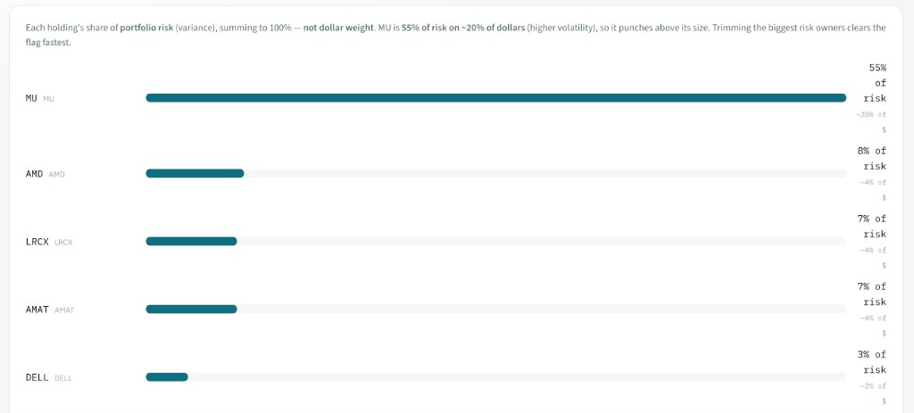

**Desired — mockup (one-line % per row):**

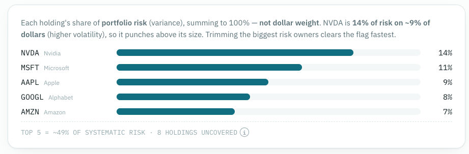

#### Current state

Right column per holding row renders as:

```
55%
of
risk
~20% of
$
```

(same broken wrap for AMD `8% of risk` / `~4% of $`, etc.)

**Code causing this** (`_who_owns()`):

```python
f'<span class="risk-wv">{rc:.0%} of risk'
f'<br><span style="font-size:9px;color:{_FAINT}">{weight_str}</span>'  # weight_str = "~20% of $"
```

**CSS constraint:** `.risk-wrow` value column is only **40px** wide (`grid-template-columns: 140px 1fr 40px`). Long text + `<br>` forces each word onto its own line.

**Meaning text today:** top caption paragraph explains the concept once (e.g. *"MU is **55% of risk on ~20% of dollars** (higher volatility)…"*) — but per-row values are unreadable, so the contrast is lost row-by-row.

#### Desired state

**1. Right column — one clean value per row (match mockup)**

Mockup shows a single right-aligned percentage per row: `14%`, `11%`, `9%`, … — no word wrap.

| Ticker | Bar | Right column |
|--------|-----|--------------|
| MU | ████████ | `55%` |
| AMD | █ | `8%` |
| … | … | … |

- Remove ` of risk` and the `<br>~X% of $` from the narrow value column (or widen column significantly if keeping dual metrics)
- Value column: `{rc:.0%}` only, `white-space: nowrap`, column width ≥ 48px (mockup uses 40px but only fits bare `%`)

**2. Risk ≠ dollar weight — explain in prose (not per-row clutter)**

Keep / strengthen the **header caption** (`bcap2`) so meaning is clear without cramming into 40px:

> Each holding's share of **portfolio risk** (variance), summing to 100% — **not dollar weight**. MU is **55% of risk on ~20% of dollars** (higher volatility), so it punches above its size. Trimming the biggest risk owners clears the flag fastest.

- Top holding gets the risk-vs-$ contrast in the caption (already partially implemented via `caption_example`)
- Optional: add a one-line legend under the caption:

  `Right column = % of portfolio risk (Euler decomposition), not % of dollars`

**3. CSS fix**

```css
.risk-wrow {
  grid-template-columns: 140px 1fr 48px;  /* or 52px if keeping "55%" at large sizes */
}
.risk-wrow .risk-wv {
  white-space: nowrap;
  font-variant-numeric: tabular-nums;
}
```

#### Root cause

| Layer | Issue |
|-------|--------|
| HTML | Verbose `{rc:.0%} of risk` + second line `~{weight:.0%} of $` in a 40px column |
| CSS | Column too narrow; no `white-space: nowrap` |
| Design drift | Mockup uses compact `%` only; live code added dual-metric per row without widening layout |

#### Acceptance criteria

- [ ] Right column shows one-line percentage per row (e.g. `55%`, `8%`) — no word-by-word wrap
- [ ] Header caption explains risk % vs dollar weight with a concrete example from top holding
- [ ] Optional legend clarifies what the right-column number means
- [ ] Bar chart + ticker/name column unchanged
- [ ] Footer `TOP 5 = ~X% OF SYSTEMATIC RISK` row still renders
- [ ] Side-by-side eyeball vs `R06-desired-who-owns-holdings-inline.png`

---

### R07 — Second opinion · Google AI (above Teach me)

**Priority:** P0
**Status:** 🔴 Open — section absent in live app; desired recorded 2026-06-16
**Code:**
- Render: `adapters/visualization/components/risk_second_opinion.py` → `render_risk_second_opinion()`
- Data/cache: `application/risk_second_opinion.py` → `load_cached_risk_second_opinion()` / `build_risk_second_opinion()`
- Placement: `adapters/visualization/tabs/risk.py` → `render()` (~lines 1445–1461)
**Mockup ref:** `risk-v8.html` lines 306–317 (panel) + line 319 (`Teach me` follows)

#### Screenshots

| | Repo path |
|---|------|
| **Current** | *(none — section not visible in live app)* |
| **Desired (mockup)** | `docs/fix-targets/screenshots/risk-tab/R07-desired-google-ai-second-opinion.png` |

**Desired — mockup (must appear directly above "Teach me · The risk story"):**

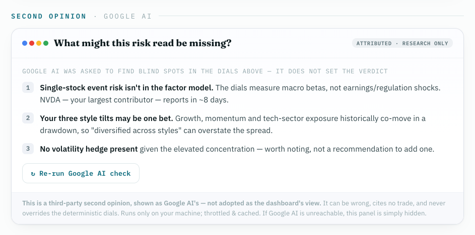

#### Current state

**The entire Google AI second-opinion block is missing** in the live Risk tab — nothing renders between the drift section and "Teach me · The risk story".

**Code exists but doesn't surface:**

| Piece | Status |
|-------|--------|
| `render_risk_second_opinion()` | Implemented (`risk_second_opinion.py`) |
| `build_risk_second_opinion()` | Called from `weekly-brief` CLI to prefetch cache |
| `load_cached_risk_second_opinion()` | Cache-only load at render time |
| Live render | `render()` calls it **after** full `_compose()` markdown |

**Why it's invisible (investigation):**

1. **Wrong page order in `render()`** — `_compose()` already includes `_drift()` → `_teach()` → `_flags_footer()`. The AI panel is appended via a **second** `st.markdown()` call *after* the entire compose block. Even when cache has data, it would appear **below** Teach me + flags, not above.

   ```python
   # risk.py render() today — WRONG order vs mockup
   st.markdown(_compose(macro), ...)          # includes _teach + _flags_footer
   ai_html = render_risk_second_opinion(...)  # too late — after teach
   ```

   **Mockup order:** `_drift` → **Second opinion · Google AI** → `_teach` → `_flags_footer`

2. **Cache miss → empty string** — `load_cached_risk_second_opinion()` returns `None` when `cited_cases.json` has no `risk_second_opinion` entry. `render_risk_second_opinion(None)` returns `""` — panel is silently hidden (no placeholder). No `cited_cases.json` found in repo; requires `weekly-brief` run with Gemini key to populate.

3. **Local-only gate** — `is_local_runtime()` must be true; off-local returns `""` (by design).

4. **Minor UI gaps vs mockup** (when it does render):
   - Missing `ri-sec` section heading: `Second opinion · Google AI` above the card
   - Missing `↻ Re-run Google AI check` button (mockup line 314)

#### Desired state

**Placement (critical):** Panel must render **immediately above** `_teach()` / "Teach me · The risk story", **below** drift — matching mockup stack:

```
… → _who_owns → _drift → [Second opinion · Google AI] → _teach → _flags_footer
```

**Fix approach:** Either split `_compose()` and inject AI HTML between `_drift` and `_teach`, or refactor `render()` to interleave two markdown blocks at the correct position.

**Panel content (match mockup when cache populated + local):**

- Section header: `SECOND OPINION · GOOGLE AI` (`ri-sec` with petrol accent on "Second opinion")
- Card (`.risk-ai`):
  - Header: Google dots + **What might this risk read be missing?** + badges `ATTRIBUTED` · `RESEARCH ONLY`
  - Subhead: *Google AI was asked to find blind spots in the dials above — it does not set the verdict*
  - Numbered blind-spot bullets (from cached `CaseResult.in_favor` / `to_watch`)
  - Button: `↻ Re-run Google AI check` (wire to refresh cache — may need Streamlit button + rerun)
  - Footer disclaimer (third-party, not verdict, local-only, hidden if unreachable)

**Cache / visibility:**

- Prefetch via `weekly-brief` (already calls `build_risk_second_opinion`) — document that user must run brief with `GEMINI_API_KEY` + `STOCKREC_LOCAL_ONLY=1`
- Consider showing data-gap card (not full hide) when local but cache empty — mockup spec says hide when unreachable; discuss whether empty-cache deserves a "Run weekly-brief to populate" stub

**Honesty rails (unchanged):**

- `ATTRIBUTED · RESEARCH ONLY` — never the verdict
- No FORBIDDEN_WORDS in rendered text
- Gated by `is_local_runtime()`

#### Acceptance criteria

- [ ] Panel visible in live app (local + cache populated) **above** "Teach me · The risk story"
- [ ] Section order matches mockup: drift → Google AI → teach → flags footer
- [ ] Section header `Second opinion · Google AI` renders above card
- [ ] Card shows title, badges, numbered points, footer disclaimer per mockup
- [ ] `↻ Re-run Google AI check` button present (functional or stubbed with clear behavior)
- [ ] Off-local: panel hidden (privacy fail-safe)
- [ ] Side-by-side eyeball vs `R07-desired-google-ai-second-opinion.png`

---

### R08 — Plain-English walkthrough (`Teach me · The risk story`)

**Priority:** P1
**Status:** 🔴 Open — current + desired recorded 2026-06-16
**Code:** `_teach()` in `adapters/visualization/tabs/risk.py` (~lines 1280–1341)
**Styles:** `.teach`, `.tbody`, `.chap`, `.donut`, `.split`, `.dleg` — in mockup only, **not** `styles.py` (same root cause as R04)
**Mockup ref:** `risk-v8.html` lines 319–327, CSS lines 100–104
**Data:** `macro` — `net_beta_by_factor` (SPY), `systematic_share`, `idiosyncratic_share`, `flags`, factor/sector context

**Related:** R04 (ENB drill also uses `class="teach"` — port CSS once for both).

#### Screenshots

| | Repo path |
|---|------|
| **Current (flat text, no bin, no chart)** | `docs/fix-targets/screenshots/risk-tab/R08-current-teach-walkthrough-flat.png` |
| **Desired (mockup — card bin + donut)** | `docs/fix-targets/screenshots/risk-tab/R08-desired-teach-walkthrough-bin.png` |

**Current — live app:**

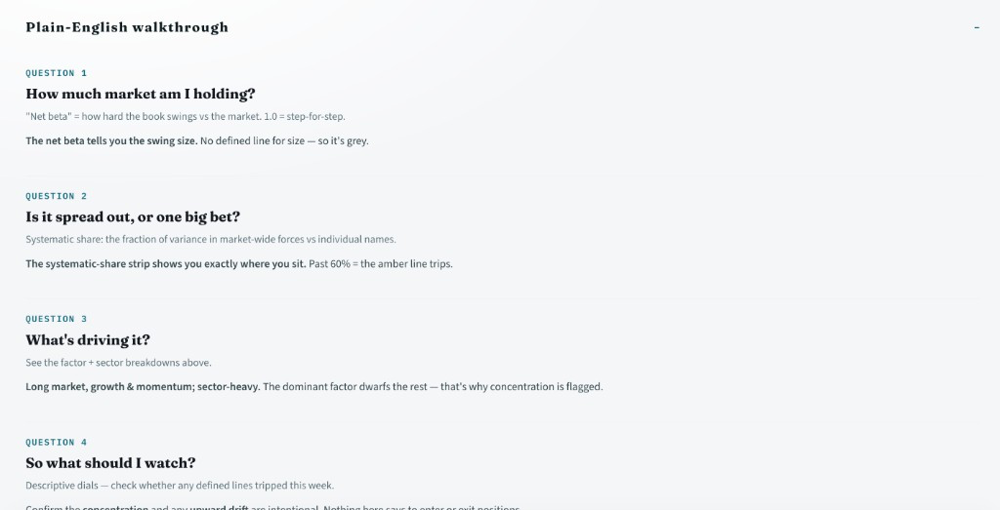

**Desired — mockup:**

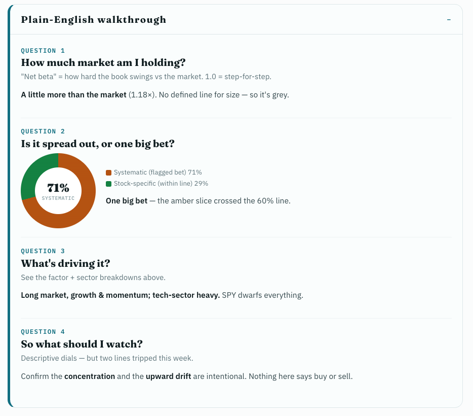

#### Current state

`Plain-English walkthrough` renders as a bare `<details class="teach">` with four Q&A blocks but:

| Gap | Live today |
|-----|------------|
| **Collapsible bin** | No visible card — flat text on page background; looks like unstyled HTML `<details>` |
| **Q2 visual** | Text only (*"The systematic-share strip shows you…"*) — **no donut chart** |
| **Q1 answer** | Generic boilerplate: *"The net beta tells you the swing size. No defined line for size — so it's grey."* |
| **Q2 answer** | Generic: references "systematic-share strip" above instead of inline donut + verdict |
| **Q3 answer** | Partially static: *"Long market, growth & momentum; sector-heavy…"* — not always accurate to live 4-factor book |
| **Q4 answer** | Generic flag language; mockup says *"two lines tripped"* when flags present |

**Section header** (`Teach me · The risk story`) renders correctly above the walkthrough.

#### Root cause

1. **Missing `.teach` CSS** (shared with R04) — no border, radius, petrol left accent, background `#fafdfd`, summary/body separator
2. **Q2 donut never implemented** — mockup uses CSS `conic-gradient` donut (`.donut`) + legend (`.dleg` / `.sw2`); `_teach()` has no visual
3. **Copy not wired to `macro`** — answers are hardcoded strings; mockup uses live values (e.g. `1.18×`, `71% SYSTEMATIC`, flag-aware Q4)

#### Desired state

**1. Collapsible card/bin (match mockup `.teach`)**

- Bordered rounded container with petrol left accent (4px)
- Summary row: **Plain-English walkthrough** + `−` / `▾` chevron
- Open state: header/body separator line
- Body padding via `.tbody` class
- Port CSS from `risk-v8.html` lines 100–102 (+ `.chap`, `.cnum`, `.cq`, `.csub`, `.ans`)

**2. Q2 — systematic/idiosyncratic donut (missing today)**

Mockup layout for Question 2:

```
[Donut: 71% SYSTEMATIC]  |  ■ Systematic (flagged bet) 71%
                         |  ■ Stock-specific (within line) 29%
                         |  One big bet — the amber slice crossed the 60% line.
```

- Build donut from `macro["systematic_share"]` + `macro["idiosyncratic_share"]`
- Amber slice when `systematic_share >= 0.60` (flagged); green for stock-specific remainder
- CSS conic-gradient approach from mockup, or reuse existing chart helper if simpler
- Verdict line: **One big bet** vs **Spread out** based on 60% threshold

**3. Data-driven answers (all four questions)**

| Q | Mockup answer pattern | Wire from `macro` |
|---|----------------------|-------------------|
| Q1 | *A little more than the market* **(1.18×)**. No defined line for size — so it's grey. | `net_beta_by_factor["SPY"]` + `classify_net_beta()` |
| Q2 | Donut + *One big bet — the amber slice crossed the 60% line.* | `systematic_share`, `flags` |
| Q3 | *Long market, growth & momentum; tech-sector heavy. SPY dwarfs everything.* | Top factors + `dominant_factor` + sector weights |
| Q4 | *Confirm the **concentration** and the **upward drift** are intentional.* | `flags` list — dynamic count and names |

- Keep honesty rails: Q4 ends with *"Nothing here says buy or sell"* (mockup) / *"Nothing here says to enter or exit positions"* (live — both OK)
- No FORBIDDEN_WORDS

**4. Typography / layout per mockup**

- `QUESTION N` — IBM Plex Mono, petrol, uppercase
- Question — Fraunces 16px bold
- `.csub` — grey definition line
- `.ans` — darker answer with selective **bold** on the verdict phrase

#### Acceptance criteria

- [ ] Walkthrough in visible `.teach` card/bin (not flat collapsible)
- [ ] Q2 shows donut + legend with live systematic/idiosyncratic %
- [ ] Q1–Q4 answers use live `macro` data, not static boilerplate
- [ ] Q4 reflects actual `flags` (count + which lines tripped)
- [ ] Layout matches mockup: chap dividers, spacing, Fraunces/mono hierarchy
- [ ] Side-by-side eyeball vs `R08-desired-teach-walkthrough-bin.png`
- [ ] Reuse `.teach` CSS port from R04 if already done

---

### R09 — Remove per-tab `↻ refresh` button (all tabs — cross-cutting)

**Priority:** P2
**Status:** 🟢 Done — removed from `dashboard.py` 2026-06-16 (verify in browser)
**Code:** `adapters/visualization/dashboard.py` — `_refresh_button()` + six call sites
**Scope:** **All tabs** (Home, Screener, Risk, My Portfolio, Stock Analysis, Trust) — not Risk-only
**Prior spec:** ADR-058 / cross-tab-loading design added this for manual cache bust; user deems redundant

#### Screenshots

| | Repo path |
|---|------|
| **Current (to remove)** | `docs/fix-targets/screenshots/risk-tab/R09-current-per-tab-refresh-button.png` |
| **Desired** | No button — tab content starts immediately below tab bar |

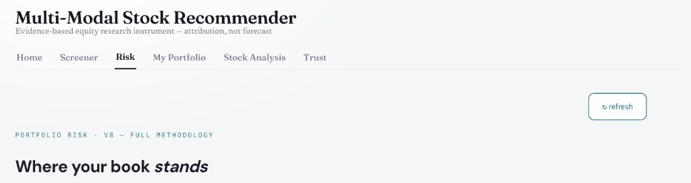

#### Current state (before fix)

Every tab rendered a right-aligned **`↻ refresh`** Streamlit button above tab content:

```python
def _refresh_button(slot_key: str) -> None:
    _, right = st.columns([6, 1])
    with right:
        if st.button("↻ refresh", key=f"refresh_{slot_key}"):
            st.cache_data.clear()
            st.rerun()
```

Called once per tab (`home`, `screener`, `risk`, `portfolio`, `analysis`, `trust`). Clears all `st.cache_data` on click — heavy-handed and visually noisy.

#### Desired state

- **Remove** `_refresh_button()` entirely
- **Remove** all six `_refresh_button(...)` calls from tab blocks
- Tab content begins directly under the tab bar (no extra column row for refresh)
- Users can still get fresh data via browser refresh / re-run `weekly-brief` / natural cache TTL (`price_cache.py` unchanged)

#### Implementation (applied)

`dashboard.py`: deleted `_refresh_button` helper and all invocations. Lazy tabs + loading overlay unchanged.

#### Acceptance criteria

- [x] No `↻ refresh` button visible on any tab
- [x] `_refresh_button` removed from `dashboard.py`
- [ ] Browser eyeball: Risk tab (and one other tab) — no button top-right
- [ ] `make check` green

---

<!-- Template for next item -->
